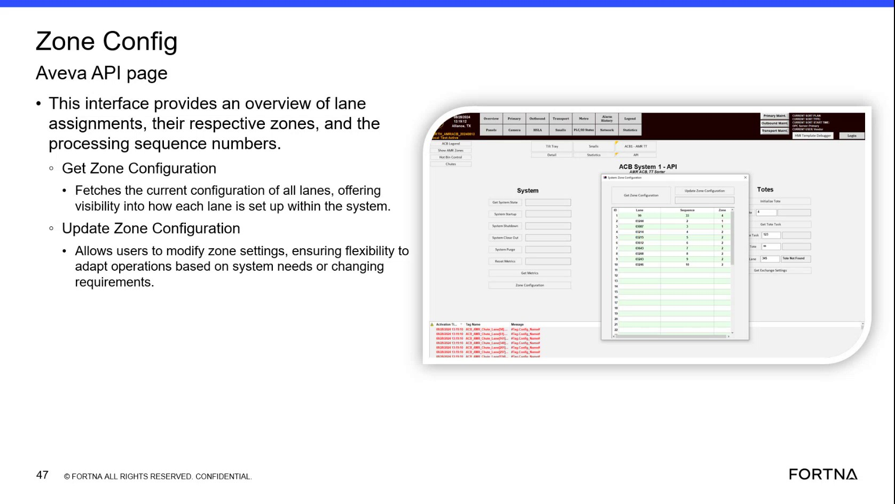

# Interpret Lane Assignment, Zone, and Processing Sequence Information on the Zone Config Screen

## Runbook Header

| Field | Value |
| --- | --- |
| Procedure ID | `proc_interpret_lane_assignment_zone_and_processing_sequence_information_on_the_zone_config_screen_v1` |
| Title | Interpret Lane Assignment, Zone, and Processing Sequence Information on the Zone Config Screen |
| Procedure Type | `reference` |
| Primary Role | `L1_support` |
| Supporting Roles | None |
| Support Safe | Yes |
| Validation Status | `needs_sme_review` |
| Merge Status | `source_finalized` |

## Summary

Use the Zone Config Aveva API page to identify and interpret the displayed lane assignment, zone, and processing sequence information for each lane based only on what the source describes and shows.

## When To Use

Use when reviewing the Zone Config Aveva API page to understand how lane assignments, their respective zones, and processing sequence numbers are presented for each lane.

## Do Not Use For

* Do not use to infer meanings for fields beyond the source-provided descriptions.
* Do not use to make unsupported configuration changes or assumptions about zone behavior.
* Do not use if the screen being viewed does not clearly display lane, zone, or processing sequence information as described by the source.

## Safety And Operational Notes

* This is a screen interpretation reference procedure and is support-safe based on the candidate.
* The source notes the page includes update capability, but this runbook is limited to viewing and interpreting displayed information only.
* Do not infer field definitions or operational meaning beyond lane assignments, respective zones, and processing sequence numbers.

## Access Or Tools Needed

* Access to the Zone Config Aveva API page

## Related Operational Context

* ctx_training_video_zone_config_interface_overview_v1

## Procedure Steps

### Step 1 — Open the Zone Config Aveva API page

**Responsible role:** L1_support

**Instruction:**
Open the Zone Config Aveva API page and confirm you are viewing the page described by the source.

**Expected result:**
The Zone Config Aveva API page is visible.

**Screens / Images:**

*The slide titled Zone Config Aveva API page and the visible field groupings associated with lane assignments, zones, and processing sequence numbers.*

**Stop or Escalate If:**

* The Zone Config Aveva API page is not available.
* The visible screen does not clearly match the source-described Zone Config page.

---

### Step 2 — Identify lane assignment information

**Responsible role:** L1_support

**Instruction:**
Review the Zone Config Aveva API page and identify the lane assignment information shown for each lane.

**Expected result:**
Lane assignment information can be located on the page for review.

**Screens / Images:**

*The portion of the Zone Config page showing lane assignments for each lane.*

**Stop or Escalate If:**

* The screen does not clearly display lane assignment information.
* The displayed values are not readable enough to interpret from the page.

---

### Step 3 — Identify corresponding zone information

**Responsible role:** L1_support

**Instruction:**
Identify the corresponding zone shown for each lane on the Zone Config Aveva API page.

**Expected result:**
Zone information corresponding to each lane can be located on the page.

**Screens / Images:**

*The portion of the Zone Config page showing the respective zone associated with each lane.*

**Stop or Escalate If:**

* The screen does not clearly display zone information.
* The relationship between lane and zone cannot be read from the page.

---

### Step 4 — Identify processing sequence number

**Responsible role:** L1_support

**Instruction:**
Identify the processing sequence number shown with the lane configuration on the Zone Config Aveva API page.

**Expected result:**
The processing sequence number displayed with the lane configuration can be located.

**Screens / Images:**

*The portion of the Zone Config page showing processing sequence numbers associated with lane configuration.*

**Stop or Escalate If:**

* The screen does not clearly display processing sequence numbers.
* The processing sequence number cannot be matched to the displayed lane configuration.

---

### Step 5 — Verify or record the displayed relationship

**Responsible role:** L1_support

**Instruction:**
Verify or record the displayed relationship between lane assignment, zone, and processing sequence number using only the values presented on the page.

**Expected result:**
The displayed relationship between lane assignment, zone, and processing sequence number is confirmed or recorded without adding unsupported interpretation.

**Screens / Images:**

*The combined display of lane assignment, zone, and processing sequence number for each lane.*

**Stop or Escalate If:**

* The screen does not clearly display the documented lane, zone, or processing sequence information.
* Verification would require inferring meanings beyond the source-provided descriptions.

---

## Success Criteria

* The Zone Config Aveva API page is opened and recognized.
* Lane assignment information is identified for each displayed lane.
* Corresponding zone information is identified for each displayed lane.
* Processing sequence number information is identified from the page.
* The relationship between lane assignment, zone, and processing sequence number is verified or recorded using only displayed values.

## Failure Conditions

* The screen does not clearly display the documented lane, zone, or processing sequence information.
* The page cannot be accessed or does not match the source-described Zone Config page.
* Interpretation would require inferring meanings beyond the source-provided descriptions.

## Escalation Guidance

* Escalate if the screen does not clearly display the documented lane, zone, or processing sequence information.
* Escalate if the displayed page does not match the Zone Config Aveva API page described by the source.
* Do not infer meanings for fields beyond the source-provided descriptions; seek SME clarification instead.

## Missing Details / Known Gaps

* The source does not provide field-by-field definitions beyond lane assignments, zones, and processing sequence numbers.
* The source does not provide exact navigation steps for reaching the Zone Config Aveva API page.
* The source does not provide role boundaries beyond the candidate's likely role assignment.
* The source does not provide timing estimates for completing this reference procedure.
* The source artifact mentions Get Zone Configuration and Update Zone Configuration, but this candidate does not provide a supported procedure for changing settings.

## Source Lineage

- Candidate IDs: candidate_training_video_interpret_zone_configuration_screen_fields
- Source ID: `training_video_day1`
- Source Type: `training_video`
