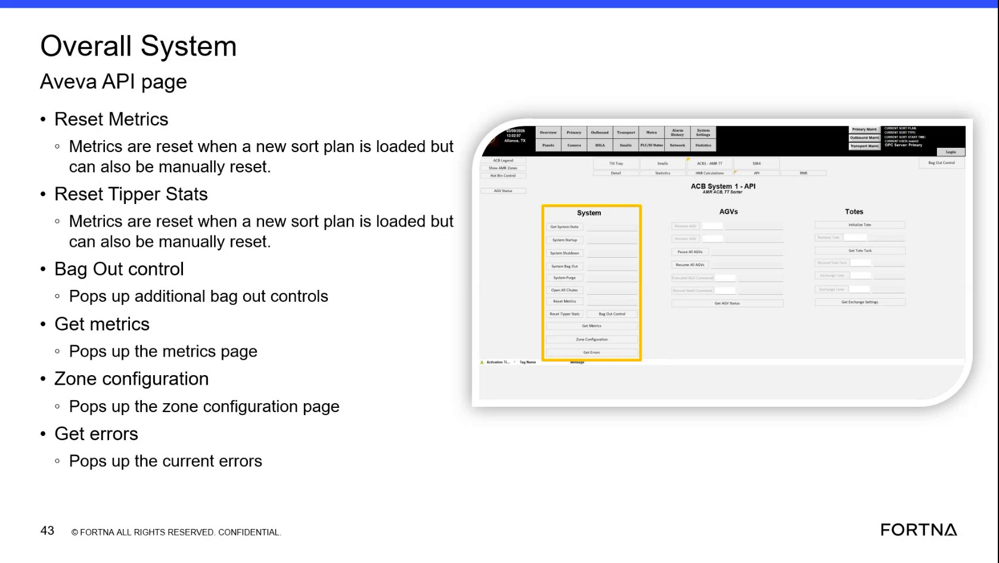

# Open the System Metrics Pop-Up From the Overall System Aveva API Page

## Runbook Header

| Field | Value |
| --- | --- |
| Procedure ID | `proc_open_the_system_metrics_pop_up_from_the_overall_system_aveva_api_page_v1` |
| Title | Open the System Metrics Pop-Up From the Overall System Aveva API Page |
| Procedure Type | `diagnostic` |
| Primary Role | `L1_support` |
| Supporting Roles | None |
| Support Safe | Yes |
| Validation Status | `needs_sme_review` |
| Merge Status | `source_finalized` |

## Summary

Open the Overall System Aveva API page, use the Get metrics control, and review the resulting pop-up that displays system metrics.

## When To Use

Use when support personnel need to display system metrics from the Overall System Aveva API page for review.

## Do Not Use For

* Do not use this runbook as a guide for interpreting specific metric fields or acceptable metric values; the source does not provide that detail.
* Do not use this runbook for opening current errors; the source identifies Get errors as a separate pop-up control.

## Safety And Operational Notes

* The source presents this as a support-safe page interaction.
* No production stop or lockout/tagout requirement is stated in the source for opening the metrics pop-up.

## Access Or Tools Needed

* Access to the Overall System Aveva API page
* Get metrics control

## Related Operational Context

* ctx_training_video_overall_system_aveva_api_page_v1
* ctx_training_video_metrics_and_errors_popups_v1

## Procedure Steps

### Step 1 — Open the Overall System Aveva API page

**Responsible role:** L1_support

**Instruction:**
Open the Overall System Aveva API page.

**Expected result:**
The Overall System Aveva API page is displayed.

**Screens / Images:**

*Overall System Aveva API page with the Get metrics entry visible among the page options.*

**Stop or Escalate If:**

* Stop or escalate if the Overall System Aveva API page cannot be opened.
* Stop or escalate if the Get metrics control is not visible on the page.

---

### Step 2 — Locate the Get metrics control

**Responsible role:** L1_support

**Instruction:**
On the Overall System Aveva API page, locate the Get metrics control.

**Expected result:**
The Get metrics control is identified on the page.

**Screens / Images:**

*The Get metrics option listed with other Overall System Aveva API page controls such as Reset Metrics, Zone configuration, and Get errors.*

**Stop or Escalate If:**

* Stop or escalate if the page is open but the Get metrics control is missing.

---

### Step 3 — Select Get metrics

**Responsible role:** L1_support

**Instruction:**
Select Get metrics to open the metrics pop-up.

**Expected result:**
A pop-up opens showing system metrics.

**Screens / Images:**

*The Get metrics control used to open the metrics page or pop-up.*

**Stop or Escalate If:**

* Escalate if the metrics pop-up does not appear.

---

### Step 4 — Review the displayed system metrics

**Responsible role:** L1_support

**Instruction:**
Review the displayed system metrics in the pop-up window.

**Expected result:**
The pop-up displays all system metrics for review.

**Stop or Escalate If:**

* Escalate if the metrics pop-up does not appear.
* Escalate or seek SME guidance if specific metric fields or expected values are needed, because the source does not document them.

---

## Success Criteria

* The Overall System Aveva API page is opened.
* The Get metrics control is located.
* Selecting Get metrics opens a pop-up.
* The pop-up displays system metrics.

## Failure Conditions

* The Overall System Aveva API page cannot be opened.
* The Get metrics control cannot be located.
* The metrics pop-up does not appear.
* The source does not provide specific metric fields or expected values for detailed validation.

## Escalation Guidance

* Escalate if the metrics pop-up does not appear after selecting Get metrics.
* Escalate to an SME if interpretation of specific metric fields or expected values is required, because the source does not provide that detail.

## Missing Details / Known Gaps

* The source does not specify navigation steps for reaching the Overall System Aveva API page.
* The source does not identify which specific metric fields appear in the pop-up.
* The source does not provide expected metric values, thresholds, or pass/fail criteria for the displayed metrics.
* The source does not provide a time estimate for completing this procedure.

## Source Lineage

- Candidate IDs: candidate_training_video_open_system_metrics_popup
- Source ID: `training_video_day1`
- Source Type: `training_video`
