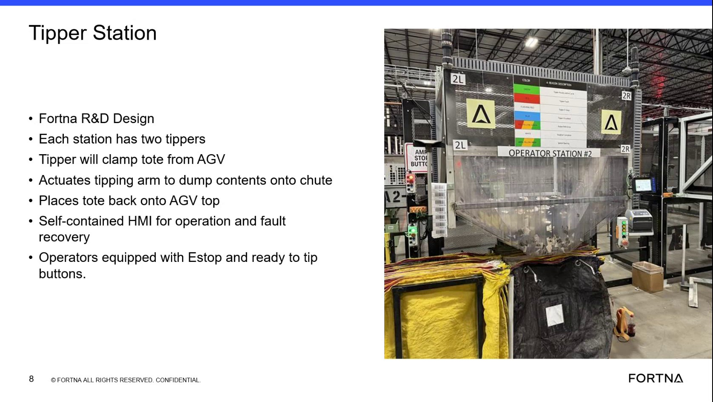

# Operate A Tipper Station Using The Ready-To-Tip Control

## Runbook Header

| Field | Value |
| --- | --- |
| Procedure ID | `proc_operate_a_tipper_station_using_the_ready_to_tip_control_v1` |
| Title | Operate A Tipper Station Using The Ready-To-Tip Control |
| Procedure Type | `operation` |
| Primary Role | `operator` |
| Supporting Roles | None |
| Support Safe | Yes |
| Validation Status | `needs_sme_review` |
| Merge Status | `source_finalized` |

## Summary

High-level operator procedure for normal tipper station use based on the training segment: a tote arrives from an AGV, the operator uses the station controls including the ready-to-tip button, and the tipper clamps, tips, discharges contents onto the chute, and returns the tote to the AGV. The source also notes a self-contained HMI is available for operation and fault recovery, but does not provide detailed screen navigation.

## When To Use

Use for the normal operator-facing tipper station handling flow described in the training source when a tote arrives from an AGV and the station is being operated using the ready-to-tip control.

## Do Not Use For

* Detailed fault recovery beyond the source statement that the HMI supports fault recovery
* Any button-by-button HMI navigation not shown in this source segment
* Any inferred interlock, reset, or alternate control sequence not explicitly identified in the source

## Safety And Operational Notes

* Operators are described as equipped with an E-stop and ready-to-tip buttons.
* Use only the operator controls explicitly identified in the source.
* Do not infer additional button sequences, interlocks, or HMI navigation that are not provided in this segment.

## Access Or Tools Needed

* Access to the operator station
* Ready-to-tip button
* Self-contained HMI
* Visual access to the tipper, AGV tote position, and chute

## Related Operational Context

* ctx_training_video_tipper_station_overview_v1
* ctx_training_video_tipper_component_flow_v1
* ctx_training_video_tipper_hmi_reference_v1
* ctx_training_video_tipper_operator_controls_v1

## Procedure Steps

### Step 1 — Identify the operator station and tipper area

**Responsible role:** operator

**Instruction:**
Go to the operator station and identify the tipper area. Note that the source states each operator station has two tippers.

**Expected result:**
The operator is positioned at the correct station and recognizes the tipper area and two-tipper arrangement.

**Screens / Images:**

*The training slide showing the operator station tipper area and the statement that each station has two tippers.*

**Stop or Escalate If:**

* The station cannot be positively identified from the source-supported visual cues
* The observed setup does not align with the source description of two tippers per station

---

### Step 2 — Confirm tote arrival from the AGV

**Responsible role:** operator

**Instruction:**
Confirm the tote arrives from the AGV at the tipper station before proceeding with the normal tipping flow.

**Expected result:**
A tote is present at the tipper station from the AGV.

**Screens / Images:**

*The slide and transcript-supported handling flow showing tote interaction between the AGV and tipper.*

**Stop or Escalate If:**

* The tote does not arrive from the AGV as expected for the normal sequence

---

### Step 3 — Use the ready-to-tip operator control

**Responsible role:** operator

**Instruction:**
Use the operator station controls provided for tipping, including the ready-to-tip button identified in the source as the operator control for tipping readiness.

**Expected result:**
The operator has used the source-identified ready-to-tip control for the normal tipping process.

**Screens / Images:**

*The operator control area on the training slide, including the ready-to-tip button and E-stop references if visible.*

**Stop or Escalate If:**

* The ready-to-tip button cannot be identified
* The normal sequence appears to require additional unsupported button presses or control logic not provided in the source

---

### Step 4 — Observe the clamp-tip-return sequence

**Responsible role:** operator

**Instruction:**
Observe the documented handling sequence: the tipper clamps the tote from the AGV, actuates the tipping arm to dump contents onto the chute, and places the tote back onto the AGV.

**Expected result:**
The tote is clamped, tipped to discharge contents onto the chute, and returned to the AGV.

**Screens / Images:**

*The slide text describing tote clamping from the AGV, tipping to the chute, and placement back onto the AGV.*

**Stop or Escalate If:**

* The tote does not follow the described clamp-tip-return sequence
* The contents do not discharge onto the chute as described
* The tote is not placed back onto the AGV

---

### Step 5 — Use the self-contained HMI if needed for operation

**Responsible role:** operator

**Instruction:**
Use the self-contained HMI as the station interface for operation if needed, based on the source statement that the HMI supports operation. Do not infer screen navigation or button sequences not shown in this segment.

**Expected result:**
The operator recognizes the HMI as the source-identified station interface for operation.

**Screens / Images:**

*The training slide reference to the self-contained HMI for operation and fault recovery.*

**Stop or Escalate If:**

* Detailed HMI navigation is required but not provided in this source segment

---

## Success Criteria

* The operator station is identified and used as the source describes.
* A tote arrives from the AGV at the tipper station.
* The ready-to-tip control is used as the operator-facing tipping readiness control.
* The tote is clamped from the AGV, tipped to discharge contents onto the chute, and returned to the AGV.

## Failure Conditions

* The operator cannot identify the correct station or tipper arrangement.
* The tote does not arrive from the AGV.
* The ready-to-tip button cannot be identified or used.
* The tote does not follow the described clamp-tip-return sequence.
* Detailed HMI interaction is required but not supported by this source segment.

## Escalation Guidance

* Escalate if the tote does not follow the described clamp-tip-return sequence, because this segment does not provide detailed recovery steps.
* Escalate if operation requires controls, interlocks, or HMI navigation not explicitly identified in the source.
* Use only the operator controls explicitly identified in the source.

## Missing Details / Known Gaps

* The source does not provide a button-by-button operating sequence.
* The source does not provide detailed HMI screens, prompts, or navigation steps.
* The source does not define explicit confirmation indicators after pressing ready-to-tip.
* The source does not provide recovery actions for abnormal tipper behavior.
* The source does not provide timing expectations or cycle duration.

## Source Lineage

- Candidate IDs: candidate_training_video_operate_tipper_station_ready_to_tip
- Source ID: `training_video_day1`
- Source Type: `training_video`
