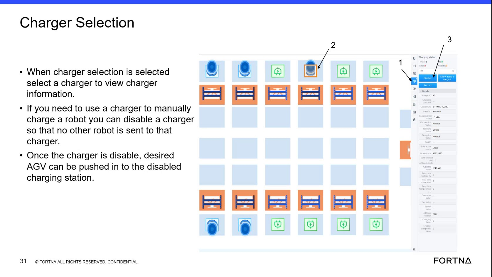

# Charge A Low-Battery Robot Until It Can Start And Rejoin System Operation

## Runbook Header

| Field | Value |
| --- | --- |
| Procedure ID | `proc_charge_a_low_battery_robot_until_it_can_start_and_rejoin_system_operation_v1` |
| Title | Charge A Low-Battery Robot Until It Can Start And Rejoin System Operation |
| Procedure Type | `recovery` |
| Primary Role | `L1_support` |
| Supporting Roles | None |
| Support Safe | Yes |
| Validation Status | `needs_sme_review` |
| Merge Status | `source_finalized` |

## Summary

Restore enough battery charge to a low-battery robot so it can start again and be returned to system operation. The source describes a manual charging approach using a reserved/disabled charger, approximate short-duration charging guidance, and re-entry once the robot has enough charge to boot and cycle on its own.

## When To Use

Use when a robot is too low on battery to continue normal operation and needs enough charge to start again so it can be added back into the system and continue charging through normal operation.

## Do Not Use For

* Do not use as a guaranteed battery recovery timing procedure; the source describes charging times and battery percentages as approximate training guidance.
* Do not use when an exact re-entry method is required; this packet does not specify the exact steps for putting the robot back into the system.
* Do not use to infer unsupported safety controls, shutdown requirements, or lockout requirements not stated in the source.

## Safety And Operational Notes

* The source states the charger used for manual charging can be disabled so no other robot is sent there while the desired AGV is pushed into the charging station.
* The source indicates charger capacity should be restored after use by turning the charger back on or re-enabling it after recovery.
* Battery timing and percentage examples are approximate training guidance, not guaranteed outcomes.
* The packet does not provide a detailed physical movement safety method for pushing or handling the robot; use only site-approved practices.

## Access Or Tools Needed

* Access to a charger
* Ability to place the robot on charge
* Access needed to return the robot to the system

## Related Operational Context

* ctx_training_video_low_battery_recovery_and_reentry_v1
* ctx_training_video_battery_task_acceptance_thresholds_v1
* ctx_training_video_manual_charging_with_disabled_charger_v1

## Procedure Steps

### Step 1 — Move the low-battery robot to a reserved charger

**Responsible role:** L1_support

**Instruction:**
Use the source-described manual charging approach to reserve a charger if needed, then move the desired low-battery robot to that charging station. The source states a charger can be disabled so no other robot is sent there, and the desired AGV can then be pushed into the disabled charging station.

**Expected result:**
The low-battery robot is positioned on a charger reserved for manual charging.

**Screens / Images:**

*Charger Selection view showing charger ID, charger status, enabled/disabled state, and which robot is on the charger.*

*Slide text stating a charger can be disabled so no other robot is sent there and the desired AGV can be pushed into the disabled charging station.*

**Stop or Escalate If:**

* The robot cannot be moved onto the charger.
* The charger cannot be reserved/disabled for manual charging.
* Another robot continues to be assigned to the charger despite the attempted reservation.

---

### Step 2 — Charge the robot until it can start again

**Responsible role:** L1_support

**Instruction:**
Leave the robot on charge and wait for it to regain enough battery to start again. The source indicates the robot may boot automatically once it has enough charge.

**Expected result:**
The robot regains enough charge to start.

**Screens / Images:**

*Transcript-supported guidance that the robot may need to be taken to a charger and may boot automatically once it has enough charge.*

**Stop or Escalate If:**

* The robot does not boot up after charging.
* The robot does not appear to regain enough charge to start.

---

### Step 3 — Use approximate charging guidance to judge readiness

**Responsible role:** L1_support

**Instruction:**
Use the training guidance only as a rough expectation: the source says it may take about 10 minutes to get enough charge to start, and gives an example that charging from about 25% for 15 minutes may bring the robot to about 40%, which is described as good enough for the system to cycle it on its own.

**Expected result:**
The operator has a rough, source-supported expectation for when the robot may be ready to start and re-enter service.

**Screens / Images:**

*Battery threshold and recovery discussion showing approximate timing and percentage examples for low-battery recovery.*

**Stop or Escalate If:**

* The robot does not start after the approximate charging period.
* The robot starts but still cannot be cycled by the system after charging.
* There is uncertainty requiring a more exact threshold than the source provides.

---

### Step 4 — Return the robot to the system after it can boot

**Responsible role:** L1_support

**Instruction:**
Once the robot has enough charge to boot up, add it back into the system so it can continue charging through normal system operation. If a charger was disabled for manual charging, re-enable it after recovery so queued AGVs can again be assigned there.

**Expected result:**
The robot is returned to the system and charger capacity is restored.

**Screens / Images:**

*Charger Selection view used to confirm the charger can be re-enabled after manual charging.*

*Recovery discussion stating the robot can be added back into the system after enough charge is regained.*

**Stop or Escalate If:**

* The robot does not boot up when attempting re-entry.
* The robot cannot be added back into the system.
* The charger cannot be returned to service after manual charging.

---

### Step 5 — Verify the robot can cycle on its own

**Responsible role:** L1_support

**Instruction:**
Verify that after re-entry the system can cycle the robot on its own.

**Expected result:**
The robot continues operating and charging normally under system control.

**Screens / Images:**

*Approximate guidance that around 40% is good enough for the system to cycle the robot on its own.*

**Stop or Escalate If:**

* The robot cannot cycle on its own after re-entry.
* The robot rejoins the system but does not continue normal operation.

---

## Success Criteria

* The low-battery robot regains enough charge to start again.
* The robot is added back into the system.
* The system can cycle the robot on its own after re-entry.
* If a charger was reserved/disabled for manual charging, it is re-enabled after recovery.

## Failure Conditions

* The robot does not boot up after charging.
* The robot cannot be added back into the system after charging.
* The robot cannot cycle on its own after re-entry.
* The charger remains disabled or unavailable after the recovery attempt.

## Escalation Guidance

* Escalate if the robot does not boot up after charging.
* Escalate if the robot cannot rejoin the system after charging.
* Escalate if charger reservation or re-enablement cannot be completed.
* Escalate if more exact battery thresholds or re-entry steps are required than the source provides.

## Missing Details / Known Gaps

* The exact method for putting the robot back into the system is not specified in this packet.
* The source does not provide a precise required battery threshold for re-entry; only approximate examples are given.
* The source does not provide a formal estimated completion time for the full procedure, only approximate charging examples.
* The packet does not specify exact HMI button names or a detailed confirmation method for successful re-entry.

## Source Lineage

- Candidate IDs: candidate_training_video_recover_low_battery_robot_for_system_reentry
- Source ID: `training_video_day1`
- Source Type: `training_video`
