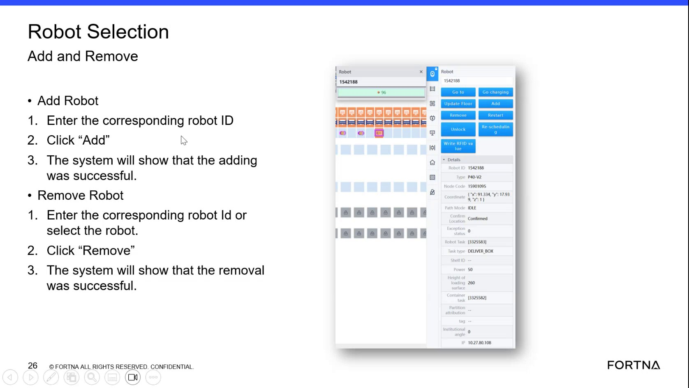

# Remove a Robot Using the Robot Selection Screen

## Runbook Header

| Field | Value |
| --- | --- |
| Procedure ID | `proc_remove_a_robot_using_the_robot_selection_screen_v1` |
| Title | Remove a Robot Using the Robot Selection Screen |
| Procedure Type | `operation` |
| Primary Role | `operator` |
| Supporting Roles | None |
| Support Safe | Yes |
| Validation Status | `needs_sme_review` |
| Merge Status | `source_finalized` |

## Summary

Use the Robot Selection Add and Remove screen to remove a robot by entering the corresponding robot ID or selecting the robot, then confirm the system reports that removal was successful.

## When To Use

Use when performing a robot removal action from the Robot Selection Add and Remove interface.

## Do Not Use For

* Do not use for robot restart actions.
* Do not use for robot add actions.
* Do not use when recovery beyond the success confirmation is required, because the source does not provide additional troubleshooting or recovery steps.

## Safety And Operational Notes

* This source describes a basic HMI action only.
* If the system does not show that the removal was successful, stop and escalate because the source does not provide additional recovery steps.

## Access Or Tools Needed

* Access to the Robot Selection Add and Remove screen
* Corresponding robot ID or ability to select the robot in the interface

## Related Operational Context

* ctx_training_video_robot_selection_add_remove_screen_v1
* ctx_training_video_robot_id_reference_v1
* ctx_training_video_robot_add_remove_success_status_v1

## Procedure Steps

### Step 1 — Open the Robot Selection Add and Remove screen

**Responsible role:** operator

**Instruction:**
Open or locate the "Robot Selection Add and Remove" screen.

**Expected result:**
The Robot Selection Add and Remove interface is visible and available for use.

**Screens / Images:**

*The slide titled "Robot Selection Add and Remove," including the Remove Robot section and the overall interface layout.*

**Stop or Escalate If:**

* Stop and escalate if the Robot Selection Add and Remove screen is not available.

---

### Step 2 — Identify the robot to remove

**Responsible role:** operator

**Instruction:**
In the Remove Robot section, enter the corresponding robot ID or select the robot.

**Expected result:**
The intended robot is identified in the Remove Robot section.

**Screens / Images:**

*The Remove Robot instructions showing that removal can be done by entering the corresponding robot ID or selecting the robot.*

**Stop or Escalate If:**

* Stop and escalate if the correct robot cannot be identified for removal.

---

### Step 3 — Click Remove

**Responsible role:** operator

**Instruction:**
Click "Remove."

**Expected result:**
The system processes the remove request.

**Screens / Images:**

*The Remove Robot workflow on the slide, including the Remove action.*

**Stop or Escalate If:**

* Stop and escalate if the Remove action cannot be performed.

---

### Step 4 — Verify removal success

**Responsible role:** operator

**Instruction:**
Verify that the system shows that the removal was successful.

**Expected result:**
The system shows that the removal was successful.

**Screens / Images:**

*The slide text stating that the system will show that the removal was successful.*

**Stop or Escalate If:**

* Stop and escalate if the system does not show that the removal was successful.

---

## Success Criteria

* The intended robot is removed using the Robot Selection Add and Remove screen.
* The system shows that the removal was successful.

## Failure Conditions

* The Robot Selection Add and Remove screen is not available.
* The correct robot cannot be entered or selected.
* The Remove action cannot be completed.
* The system does not show that the removal was successful.

## Escalation Guidance

* Escalate if the system does not show that the removal was successful.
* Escalate if the screen or remove action is unavailable, because the source provides no additional recovery steps.

## Missing Details / Known Gaps

* The source does not define specific conditions for when a robot should be removed.
* The source does not identify any supporting roles or approval requirements.
* The source does not provide troubleshooting steps if removal fails.
* The source does not specify the exact appearance or wording of the success indication.
* The source does not provide time estimates, production stop requirements, or LOTO requirements.

## Source Lineage

- Candidate IDs: candidate_training_video_remove_robot_by_robot_id_or_selection
- Source ID: `training_video_day1`
- Source Type: `training_video`
