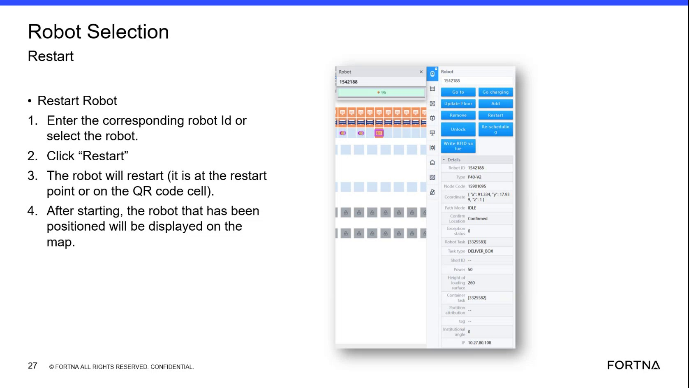

# Restart a Robot From the Restart Panel

## Runbook Header

| Field | Value |
| --- | --- |
| Procedure ID | `proc_restart_a_robot_from_the_restart_panel_v1` |
| Title | Restart a Robot From the Restart Panel |
| Procedure Type | `operation` |
| Primary Role | `operator` |
| Supporting Roles | None |
| Support Safe | Yes |
| Validation Status | `needs_sme_review` |
| Merge Status | `source_finalized` |

## Summary

Use the documented restart panel to select a robot by ID or selection control, click Restart, allow the restart cycle to complete, and verify map visibility when the robot is positioned at a restart point or QR code cell.

## When To Use

Use when an operator needs to restart a selected robot from the restart panel and confirm whether it returns to the map after restart.

## Do Not Use For

* Do not use this procedure to conclude a restart failed solely because the robot does not appear on the map immediately after restart.
* Do not use this procedure as a complete recovery method when the robot is not positioned at a restart point or on the QR code cell.

## Safety And Operational Notes

* Map visibility after restart depends on the robot being positioned so it can identify a label or QR code cell.
* If a robot is stopped between labels, it may not snap back onto the map automatically after restart because it cannot see a label.
* Further recovery may be required if the positioning condition is not met or the robot does not return to the map.

## Access Or Tools Needed

* Access to the robot restart panel
* Robot ID or robot selection control
* Map display

## Related Operational Context

* ctx_training_video_robot_restart_panel_reference_v1
* ctx_training_video_robot_map_visibility_after_restart_v1

## Procedure Steps

### Step 1 — Open the restart panel and identify robot selection

**Responsible role:** operator

**Instruction:**
Open the robot restart panel and identify the area where you can enter the corresponding robot ID or select the robot to restart.

**Expected result:**
The restart panel is open and the robot selection area is visible.

**Screens / Images:**

*Restart Robot panel showing robot ID entry or robot selection control and the Restart button.*

**Stop or Escalate If:**

* The restart panel cannot be accessed.
* The robot selection area cannot be identified.

---

### Step 2 — Select the robot to restart

**Responsible role:** operator

**Instruction:**
Enter the corresponding robot ID or select the robot you want to restart.

**Expected result:**
The intended robot is selected in the restart panel.

**Screens / Images:**

*Robot selection area where the operator enters the corresponding robot ID or selects the robot.*

**Stop or Escalate If:**

* The correct robot cannot be identified or selected in the panel.

---

### Step 3 — Click Restart

**Responsible role:** operator

**Instruction:**
Click the Restart control on the panel.

**Expected result:**
The restart command is issued to the selected robot.

**Screens / Images:**

*Restart control on the restart panel.*

**Stop or Escalate If:**

* The Restart control is unavailable or does not respond.

---

### Step 4 — Allow the robot to restart

**Responsible role:** operator

**Instruction:**
Allow the robot to go through its restart cycle.

**Expected result:**
The robot proceeds through the restart cycle.

**Stop or Escalate If:**

* The robot does not proceed through the restart cycle.

---

### Step 5 — Check robot positioning for map visibility

**Responsible role:** operator

**Instruction:**
Check whether the robot is positioned at a restart point or on the QR code cell, as described by the source.

**Expected result:**
You know whether the robot meets the documented positioning condition for appearing on the map after restart.

**Stop or Escalate If:**

* The robot is not at a restart point or on the QR code cell.
* The robot is stopped between labels and cannot see a label.

---

### Step 6 — Verify the robot appears on the map

**Responsible role:** operator

**Instruction:**
Verify that after starting, the positioned robot is displayed on the map.

**Expected result:**
The restarted robot is displayed on the map when the documented positioning condition is met.

**Screens / Images:**

*Map display expectation after restart for a robot that has been positioned correctly.*

**Stop or Escalate If:**

* The robot does not return to the map after restart.
* The positioning condition is not met and further recovery is required.

---

## Success Criteria

* The intended robot is selected from the restart panel.
* The Restart action is initiated from the panel.
* The robot completes its restart cycle.
* When positioned at a restart point or on the QR code cell, the robot is displayed on the map after starting.

## Failure Conditions

* The restart panel or robot selection area cannot be accessed or identified.
* The intended robot cannot be selected.
* The Restart action cannot be initiated.
* The robot does not complete the restart cycle.
* The robot is between labels or otherwise cannot identify a label or QR code cell after restart.
* The robot does not appear on the map after restart.

## Escalation Guidance

* If the robot does not appear on the map after restart, do not assume the restart failed; the source states map visibility depends on label or QR code recognition.
* If the robot is not positioned at a restart point or on the QR code cell, or if it is between labels and cannot see a label, further recovery may be required.
* Escalate when the documented positioning condition is not met or the robot does not return to the map after restart.

## Missing Details / Known Gaps

* The source does not provide a time estimate for the restart procedure.
* The source does not specify role boundaries beyond operator-oriented training language.
* The source does not provide a detailed escalation path or named support contact.
* The source does not provide explicit UI field names beyond robot ID/select and Restart.
* The source does not provide a separate artifact specifically showing the post-restart map display beyond the referenced training frame.

## Source Lineage

- Candidate IDs: candidate_training_video_restart_robot_from_restart_panel
- Source ID: `training_video_day1`
- Source Type: `training_video`
