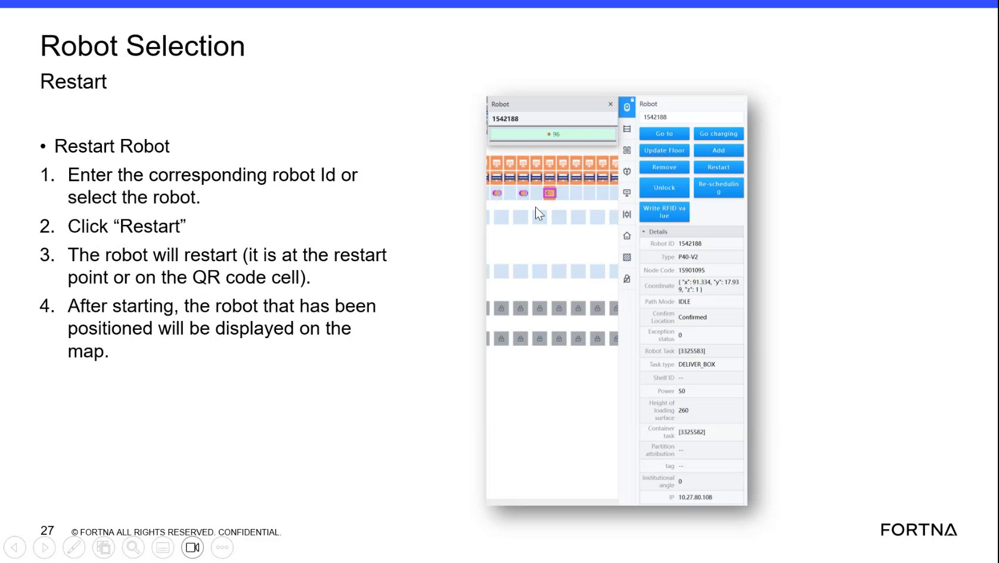

# Restart A Robot From The Robot Selection Restart Screen

## Runbook Header

| Field | Value |
| --- | --- |
| Procedure ID | `proc_restart_a_robot_from_the_robot_selection_restart_screen_v1` |
| Title | Restart A Robot From The Robot Selection Restart Screen |
| Procedure Type | `operation` |
| Primary Role | `L1_support` |
| Supporting Roles | None |
| Support Safe | Yes |
| Validation Status | `needs_sme_review` |
| Merge Status | `source_finalized` |

## Summary

Use the Robot Selection Restart screen to identify a robot by robot ID or by selecting it on the screen, then initiate Restart. The source states the robot will restart when it is at the restart point or on the QR code cell, and after starting the positioned robot will be displayed.

## When To Use

Use this procedure when a robot needs to be restarted from the Robot Selection Restart screen and the robot can be identified by corresponding robot ID or direct selection. The source ties successful restart to the robot being at the restart point or on the QR code cell.

## Do Not Use For

* Do not use this runbook for add robot or remove robot actions.
* Do not use this runbook for Go to / send robot to a square actions.
* Do not use this runbook when the source conditions for restart position are not met or cannot be verified.

## Safety And Operational Notes

* The source states restart is associated with the robot being at the restart point or on the QR code cell.
* Operational details are limited because the procedure is derived from slide OCR rather than a fully narrated step-by-step demonstration.

## Access Or Tools Needed

* Access to the Robot Selection Restart screen
* Robot ID or ability to select the robot
* Visibility of the robot position or displayed robot status

## Related Operational Context

* ctx_training_video_robot_selection_restart_screen_v1
* ctx_training_video_restart_position_reference_v1

## Procedure Steps

### Step 1 — Open the Robot Selection Restart screen

**Responsible role:** L1_support

**Instruction:**
Open the Robot Selection Restart screen.

**Expected result:**
The Robot Selection Restart screen is visible and available for use.

**Screens / Images:**

*Robot Selection Restart screen title and the restart workflow controls shown on the training slide.*

**Stop or Escalate If:**

* Escalate if the Robot Selection Restart screen cannot be opened.
* Escalate if the expected restart screen title or controls are not available.

---

### Step 2 — Enter or select the robot

**Responsible role:** L1_support

**Instruction:**
Enter the corresponding robot ID or select the robot from the screen.

**Expected result:**
The intended robot is selected on the Robot Selection Restart screen.

**Screens / Images:**

*The robot selection area showing entry of the corresponding robot ID or direct robot selection.*

**Stop or Escalate If:**

* Escalate if the robot cannot be selected.
* Escalate if the corresponding robot ID is not available.

---

### Step 3 — Click Restart

**Responsible role:** L1_support

**Instruction:**
Click the Restart control.

**Expected result:**
The restart action is initiated for the selected robot.

**Screens / Images:**

*The Restart control on the Robot Selection Restart screen.*

**Stop or Escalate If:**

* Escalate if Restart cannot be clicked or does not initiate.

---

### Step 4 — Verify restart position condition

**Responsible role:** L1_support

**Instruction:**
Verify that the robot is at the restart point or on the QR code cell as stated by the source.

**Expected result:**
The robot is confirmed to be at the restart point or on the QR code cell.

**Screens / Images:**

*The slide text stating the robot will restart when it is at the restart point or on the QR code cell.*

**Stop or Escalate If:**

* Escalate if the robot is not at the restart point or on the QR code cell as described by the source.
* Escalate if the robot position cannot be verified.

---

### Step 5 — Confirm the positioned robot is displayed

**Responsible role:** L1_support

**Instruction:**
After starting, confirm that the positioned robot is displayed on the screen.

**Expected result:**
The positioned robot is displayed after starting.

**Screens / Images:**

*The source-stated outcome that after starting the positioned robot will be displayed.*

**Stop or Escalate If:**

* Escalate if the robot does not restart.
* Escalate if the positioned robot is not displayed after starting.

---

## Success Criteria

* The intended robot is selected by corresponding robot ID or direct selection.
* Restart is initiated from the Robot Selection Restart screen.
* The robot is at the restart point or on the QR code cell.
* After starting, the positioned robot is displayed.

## Failure Conditions

* The robot cannot be selected or the corresponding robot ID is not available.
* The robot does not restart.
* The robot is not at the restart point or on the QR code cell as described by the source.
* The positioned robot is not displayed after starting.

## Escalation Guidance

* Escalate if the robot cannot be selected or the corresponding robot ID is not available.
* Escalate if the robot does not restart or is not at the restart point or on the QR code cell as described by the source.
* Escalate if the positioned robot is not displayed after starting.

## Missing Details / Known Gaps

* The source does not provide navigation details for how to reach the Robot Selection Restart screen.
* The source does not define exact on-screen field names beyond robot ID/selection and Restart.
* The source does not provide a time estimate for completing the restart.
* The source does not specify whether production stop or LOTO is required.
* The source does not provide detailed recovery actions if restart fails beyond escalation.
* The source does not provide commands, API calls, or backend verification steps.

## Source Lineage

- Candidate IDs: candidate_training_video_restart_robot_from_robot_selection_screen
- Source ID: `training_video_day1`
- Source Type: `training_video`
