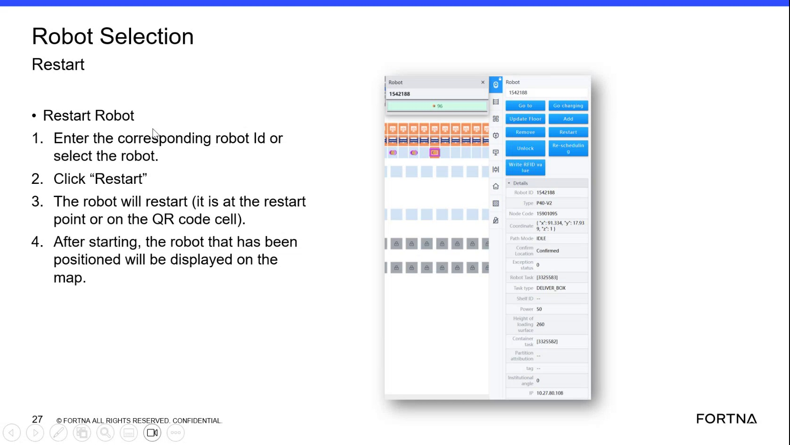

# Restart a Selected Robot From the Robot Selection Screen

## Runbook Header

| Field | Value |
| --- | --- |
| Procedure ID | `proc_restart_a_selected_robot_from_the_robot_selection_screen_v1` |
| Title | Restart a Selected Robot From the Robot Selection Screen |
| Procedure Type | `recovery` |
| Primary Role | `operator` |
| Supporting Roles | None |
| Support Safe | Yes |
| Validation Status | `needs_sme_review` |
| Merge Status | `source_finalized` |

## Summary

Use the Robot Selection screen to restart a specific robot by entering the robot ID or selecting the robot, clicking Restart, confirming the robot is at the restart point or on the QR code cell as stated by the source, and verifying that after starting the positioned robot is displayed on the station map.

## When To Use

Use when a specific robot needs to be restarted from the Robot Selection screen and the operator needs to verify the robot is displayed on the station map after startup.

## Safety And Operational Notes

* Stop and escalate if the robot is not at the restart point or on the QR code cell as required by the source.

## Access Or Tools Needed

* Access to the Robot Selection screen
* Robot ID or ability to select the robot on screen
* Restart control on the HMI
* Station map display

## Related Operational Context

* ctx_training_video_robot_selection_restart_robot_v1
* ctx_training_video_robot_restart_position_requirement_v1
* ctx_training_video_robot_map_post_restart_display_v1

## Procedure Steps

### Step 1 — Open the Robot Selection restart screen

**Responsible role:** operator

**Instruction:**
Open or use the Robot Selection screen with the Restart Robot function.

**Expected result:**
The Robot Selection screen and Restart Robot area are available for use.

**Screens / Images:**

*Robot Selection screen and Restart Robot area.*

**Stop or Escalate If:**

* The Robot Selection screen or Restart Robot function cannot be accessed.

---

### Step 2 — Identify the robot to restart

**Responsible role:** operator

**Instruction:**
Enter the corresponding robot ID or select the robot from the screen.

**Expected result:**
The intended robot is selected for restart.

**Screens / Images:**

*Robot ID entry or robot selection area on the Robot Selection screen.*

**Stop or Escalate If:**

* The correct robot cannot be identified from the screen.

---

### Step 3 — Initiate the restart

**Responsible role:** operator

**Instruction:**
Click "Restart".

**Expected result:**
The restart command is issued for the selected robot.

**Screens / Images:**

*Restart control on the Robot Selection screen.*

**Stop or Escalate If:**

* The Restart action is unavailable for the selected robot.

---

### Step 4 — Confirm the restart position requirement

**Responsible role:** operator

**Instruction:**
Verify the robot is at the restart point or on the QR code cell as stated on the slide.

**Expected result:**
The robot meets the position requirement stated by the source for restart.

**Screens / Images:**

*Slide text stating the robot will restart when it is at the restart point or on the QR code cell.*

**Stop or Escalate If:**

* The robot is not at the restart point or on the QR code cell as required by the source.

---

### Step 5 — Verify the robot appears on the station map after starting

**Responsible role:** operator

**Instruction:**
After starting, check that the positioned robot is displayed on the station map.

**Expected result:**
The positioned robot is displayed on the station map after starting.

**Screens / Images:**

*Map display indication that the positioned robot is displayed after starting.*

**Stop or Escalate If:**

* The robot does not appear on the station map after starting.

---

## Success Criteria

* The selected robot is restarted from the Robot Selection screen.
* The robot meets the source-stated position requirement of being at the restart point or on the QR code cell.
* After starting, the positioned robot is displayed on the station map.

## Failure Conditions

* The Robot Selection screen or Restart Robot function is not available.
* The correct robot cannot be identified or selected.
* The robot is not at the restart point or on the QR code cell.
* The robot does not appear on the station map after starting.

## Escalation Guidance

* Stop and escalate if the robot is not at the restart point or on the QR code cell as required by the source.
* Escalate if the robot does not appear on the station map after starting.

## Missing Details / Known Gaps

* The source does not provide an estimated completion time.
* The source does not specify whether production stop is required.
* The source does not specify whether lockout/tagout is required.
* The source does not provide explicit on-screen success messages for the restart action.
* The source does not provide detailed troubleshooting steps beyond escalation when the position requirement or map display verification fails.

## Source Lineage

- Candidate IDs: candidate_training_video_restart_selected_robot
- Source ID: `training_video_day1`
- Source Type: `training_video`
