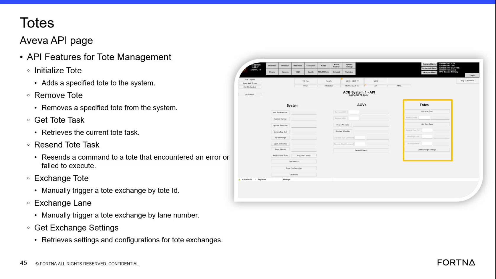

# Retrieve Tote Exchange Settings

## Runbook Header

| Field | Value |
| --- | --- |
| Procedure ID | `proc_retrieve_tote_exchange_settings_v1` |
| Title | Retrieve Tote Exchange Settings |
| Procedure Type | `reference` |
| Primary Role | `L1_support` |
| Supporting Roles | None |
| Support Safe | Yes |
| Validation Status | `needs_sme_review` |
| Merge Status | `source_finalized` |

## Summary

Use the Get Exchange Settings function on the tote management API page to retrieve tote exchange settings and configuration information for review or documentation.

## When To Use

Use when you need to retrieve and review the current tote exchange settings and configuration information from the tote management interface/API page.

## Do Not Use For

* Do not use this procedure to modify tote exchange settings.
* Do not use this procedure to infer setting meanings or corrective actions beyond what the source provides.

## Safety And Operational Notes

* This candidate is marked support-safe.
* Do not invent setting meanings or corrective actions beyond what the source provides.

## Access Or Tools Needed

* Access to tote management interface or API-backed Get Exchange Settings function

## Related Operational Context

* ctx_training_video_tote_management_api_overview_v1

## Procedure Steps

### Step 1 — Open Get Exchange Settings

**Responsible role:** L1_support

**Instruction:**
Open the tote management API page and locate the Get Exchange Settings function.

**Expected result:**
The Get Exchange Settings function is visible and available to use.

**Screens / Images:**

*The tote management API page listing Get Exchange Settings among the available tote management functions.*

**Stop or Escalate If:**

* Escalate if exchange settings cannot be retrieved.
* Stop if the Get Exchange Settings function is not available in the interface shown by the source.

---

### Step 2 — Run settings retrieval

**Responsible role:** L1_support

**Instruction:**
Run the retrieval action for exchange settings from the Get Exchange Settings function.

**Expected result:**
The interface returns tote exchange settings and configuration information.

**Screens / Images:**

*The Get Exchange Settings function on the tote management API page that is used to retrieve settings.*

**Stop or Escalate If:**

* Escalate if exchange settings cannot be retrieved.

---

### Step 3 — Review returned settings

**Responsible role:** L1_support

**Instruction:**
Review the returned tote exchange settings and configuration values.

**Expected result:**
The returned settings are visible for inspection.

**Stop or Escalate If:**

* Escalate if exchange settings cannot be retrieved.

---

### Step 4 — Compare settings to intended interpretation

**Responsible role:** L1_support

**Instruction:**
Compare the displayed settings to the exchange action you plan to interpret or document.

**Expected result:**
The user has aligned the displayed settings with the exchange action under review.

**Stop or Escalate If:**

* Stop if interpretation would require inventing setting meanings not provided by the source.

---

### Step 5 — Record settings exactly as shown

**Responsible role:** L1_support

**Instruction:**
Record the observed settings exactly as returned by the interface.

**Expected result:**
The observed settings are documented exactly as displayed.

**Stop or Escalate If:**

* Stop if you would need to add unsupported meaning or corrective guidance beyond what the source provides.

---

## Success Criteria

* The Get Exchange Settings function is accessed successfully.
* Tote exchange settings and configuration information are retrieved.
* The returned settings are reviewed and recorded exactly as displayed.

## Failure Conditions

* The Get Exchange Settings function cannot be found or accessed.
* Exchange settings cannot be retrieved.
* The user would need to invent setting meanings or corrective actions not supported by the source.

## Escalation Guidance

* Escalate if exchange settings cannot be retrieved.
* Escalate if the interface does not provide the expected settings and configuration information.
* Do not provide corrective actions or setting interpretations beyond what the source explicitly supports.

## Missing Details / Known Gaps

* The source does not provide exact button names, field names, or navigation clicks beyond the presence of Get Exchange Settings.
* The source does not provide command-line, API request, or parameter details for the retrieval action.
* The source does not define the meaning of individual exchange settings or acceptable value ranges.
* The source does not provide explicit role boundaries beyond likely L1 support usage.
* The source does not provide a time estimate for completing this procedure.

## Source Lineage

- Candidate IDs: candidate_training_video_retrieve_tote_exchange_settings
- Source ID: `training_video_day1`
- Source Type: `training_video`
