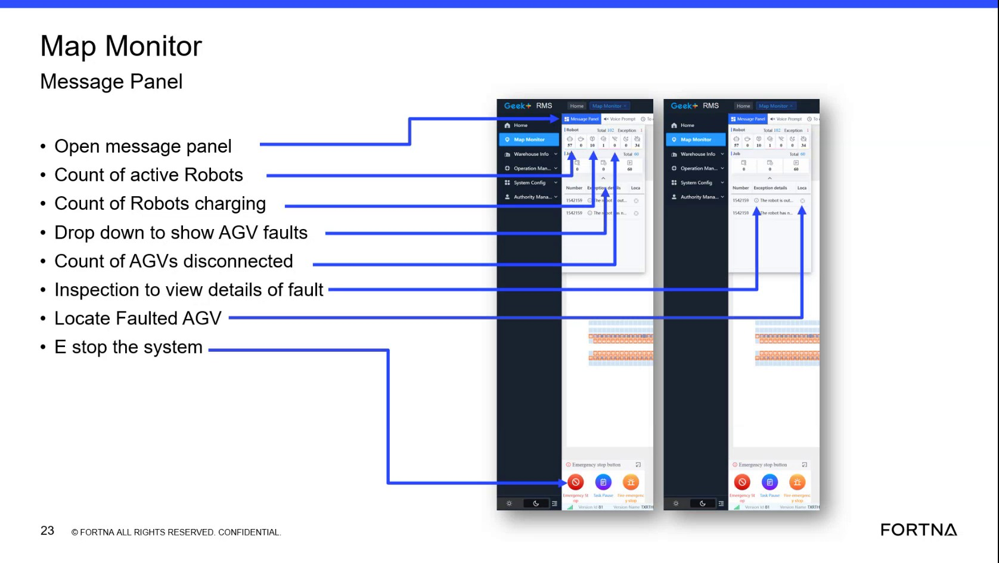

# Reveal Current AGV Faults From The Summary Area Drop-Down

## Runbook Header

| Field | Value |
| --- | --- |
| Procedure ID | `proc_reveal_current_agv_faults_from_the_summary_area_drop_down_v1` |
| Title | Reveal Current AGV Faults From The Summary Area Drop-Down |
| Procedure Type | `diagnostic` |
| Primary Role | `operator` |
| Supporting Roles | None |
| Support Safe | Yes |
| Validation Status | `needs_sme_review` |
| Merge Status | `source_finalized` |

## Summary

Use the small drop-down in the Map Monitor summary area to expose current AGV fault or error information when the fault area is hidden.

## When To Use

Use this procedure when working in the Map Monitor summary area and current AGV faults may be present but the fault area is hidden. The source states that when a current fault needs to be addressed, it will show up in this drop-down area and can be viewed by clicking the drop-down menu.

## Do Not Use For

* Resolving or clearing AGV faults
* Determining fault causes not shown in the interface
* Performing recovery actions not stated in the source

## Safety And Operational Notes

* This source supports viewing current AGV faults only.
* Do not invent fault causes or recovery actions not stated in the source.

## Access Or Tools Needed

* Access to the map monitor summary area
* Fault drop-down control on the HMI

## Related Operational Context

* ctx_training_video_agv_fault_dropdown_v1

## Procedure Steps

### Step 1 — Locate the summary-area fault drop-down

**Responsible role:** operator

**Instruction:**
In the Map Monitor summary area, locate the small drop-down associated with AGV faults.

**Expected result:**
The small drop-down control for AGV faults is identified in the summary area.

**Screens / Images:**

*The map monitor summary area and the small drop-down used to show AGV faults.*

**Stop or Escalate If:**

* The summary-area AGV fault drop-down cannot be located.

---

### Step 2 — Open the drop-down if the fault area is hidden

**Responsible role:** operator

**Instruction:**
If the fault area is hidden, click the drop-down menu to expand it.

**Expected result:**
The hidden fault area expands.

**Screens / Images:**

*The small drop-down in the summary area that can be clicked to reveal current AGV faults.*

**Stop or Escalate If:**

* A current fault is suspected but the drop-down does not reveal any error details.

---

### Step 3 — View the displayed AGV errors

**Responsible role:** operator

**Instruction:**
View the current fault or error entries shown in the expanded area.

**Expected result:**
Current AGV errors are visible in the expanded drop-down area.

**Screens / Images:**

*The expanded summary-area fault section where current AGV errors are shown.*

**Stop or Escalate If:**

* A current fault is suspected but no error details appear after opening the drop-down.

---

### Step 4 — Record the visible errors

**Responsible role:** operator

**Instruction:**
Record the visible errors that need to be addressed.

**Expected result:**
The visible AGV errors are documented for follow-up.

**Stop or Escalate If:**

* No error details are available to record after opening the drop-down.
* Additional diagnosis or recovery is needed beyond what is shown in the source.

---

## Success Criteria

* The small summary-area drop-down is located.
* The drop-down is opened when the fault area is hidden.
* Current AGV fault or error entries are visible in the expanded area.
* Visible errors are recorded for follow-up.

## Failure Conditions

* The AGV fault drop-down cannot be located.
* The drop-down does not reveal the fault area.
* A current fault is suspected but no error details appear after opening the drop-down.

## Escalation Guidance

* Escalate if a current fault is suspected but no error details appear after opening the drop-down.
* Escalate for diagnosis or recovery beyond viewing the displayed errors, because the source does not provide fault-cause or recovery steps.

## Missing Details / Known Gaps

* The source does not provide exact UI labels for the drop-down control.
* The source does not provide fault resolution or recovery steps.
* The source does not provide a required documentation destination or recording format.
* The source does not provide time estimates for completing this procedure.

## Source Lineage

- Candidate IDs: candidate_training_video_reveal_current_agv_faults_from_dropdown
- Source ID: `training_video_day1`
- Source Type: `training_video`
