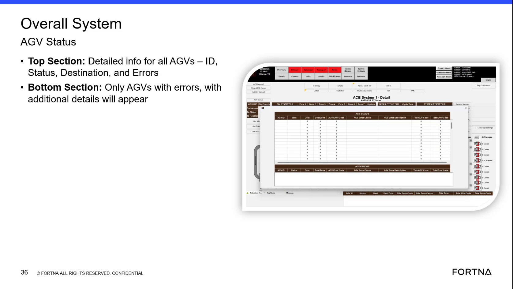

# Review Overall System AGV Status Popup For Fleet Status And Errors

## Runbook Header

| Field | Value |
| --- | --- |
| Procedure ID | `proc_review_overall_system_agv_status_popup_for_fleet_status_and_errors_v1` |
| Title | Review Overall System AGV Status Popup For Fleet Status And Errors |
| Procedure Type | `diagnostic` |
| Primary Role | `L1_support` |
| Supporting Roles | None |
| Support Safe | Yes |
| Validation Status | `needs_sme_review` |
| Merge Status | `source_finalized` |

## Summary

Use the Overall System AGV Status popup to review fleet-wide AGV information. The source indicates the top section shows detailed information for all AGVs, including ID, Status, Destination, and Errors, while the bottom section shows only AGVs with errors and additional detail.

## When To Use

Use when reviewing current AGV fleet status on the HMI and when identifying which AGVs show errors and additional error detail on the Overall System AGV Status popup.

## Do Not Use For

* Do not use this procedure to infer meanings or corrective actions beyond the status, destination, errors, and additional detail explicitly shown on the popup.
* Do not use this procedure when the needed AGV information is not visible on the popup.

## Safety And Operational Notes

* This procedure is source-supported as a status and error review activity on an HMI popup.
* Do not infer corrective actions beyond what is explicitly shown by the source.

## Access Or Tools Needed

* Access to the HMI screen showing the 'Overall System AGV Status' popup
* Visibility of AGV fields for ID, Status, Destination, and Errors

## Related Operational Context

* ctx_training_video_agv_status_popup_overview_v1
* ctx_training_video_agv_status_fields_v1
* ctx_training_video_agv_error_detail_section_v1

## Procedure Steps

### Step 1 — Open or view the Overall System AGV Status popup

**Responsible role:** L1_support

**Instruction:**
Open or view the 'Overall System AGV Status' popup on the HMI.

**Expected result:**
The Overall System AGV Status popup is visible.

**Screens / Images:**

*HMI popup labeled 'Overall System AGV Status' with top and bottom sections.*

**Stop or Escalate If:**

* Escalate if the needed AGV information is not visible on the popup.

---

### Step 2 — Review AGV fields in the top section

**Responsible role:** L1_support

**Instruction:**
In the top section, review the listed AGV information fields for all AGVs: ID, Status, Destination, and Errors.

**Expected result:**
The top section shows the standard AGV information fields for all AGVs.

**Screens / Images:**

*Top section showing detailed info for all AGVs, including ID, Status, Destination, and Errors.*

**Stop or Escalate If:**

* Escalate if the needed AGV information is not visible on the popup.

---

### Step 3 — Identify status, destination, and error state for each AGV

**Responsible role:** L1_support

**Instruction:**
Check each AGV entry to identify the reported status, destination, and whether an error is shown.

**Expected result:**
Each AGV entry has been reviewed for status, destination, and error indication.

**Screens / Images:**

*AGV rows in the top section showing status, destination, and error fields.*

**Stop or Escalate If:**

* Escalate if the displayed information is insufficient to understand the reported error.
* Do not infer meanings or corrective actions beyond the status, destination, errors, and additional detail explicitly shown by the source.

---

### Step 4 — Review the bottom section for AGVs with errors

**Responsible role:** L1_support

**Instruction:**
In the bottom section, look for AGVs that appear with errors and review the additional detail shown for those AGVs.

**Expected result:**
AGVs with errors are identified in the bottom section and their additional detail is visible.

**Screens / Images:**

*Bottom section of the popup showing only AGVs with errors and additional details.*

**Stop or Escalate If:**

* Escalate if the displayed information is insufficient to understand the reported error.
* Do not infer meanings or corrective actions beyond the status, destination, errors, and additional detail explicitly shown by the source.

---

### Step 5 — Record AGVs shown with errors

**Responsible role:** L1_support

**Instruction:**
Record which AGVs are listed with errors and the associated status, destination, and error details shown on the popup.

**Expected result:**
A record exists of the AGVs shown with errors and the details visible on the popup.

**Screens / Images:**

*Displayed AGV status and error detail fields used to record which AGVs have errors.*

**Stop or Escalate If:**

* Escalate if the displayed information is insufficient to understand the reported error.
* Do not infer meanings or corrective actions beyond the status, destination, errors, and additional detail explicitly shown by the source.

---

## Success Criteria

* The Overall System AGV Status popup is visible.
* The user can review AGV ID, Status, Destination, and Errors for all AGVs.
* The user can identify which AGVs appear in the error-focused bottom section.
* The user records which AGVs are listed with errors and the associated displayed details.

## Failure Conditions

* The Overall System AGV Status popup is not visible.
* Needed AGV information is not visible on the popup.
* Displayed information is insufficient to understand the reported error.
* The user would need to infer meanings or corrective actions not explicitly shown by the source.

## Escalation Guidance

* Escalate if the needed AGV information is not visible on the popup.
* Escalate if the displayed information is insufficient to understand the reported error.

## Missing Details / Known Gaps

* The source does not specify the exact navigation path to open the Overall System AGV Status popup.
* The source does not define corrective actions for any AGV error shown on the popup.
* The source does not provide a time estimate for completing this review.
* The source does not specify supporting roles beyond the inferred L1 support reviewer role.

## Source Lineage

- Candidate IDs: candidate_training_video_review_overall_system_agv_status_popup
- Source ID: `training_video_day1`
- Source Type: `training_video`
