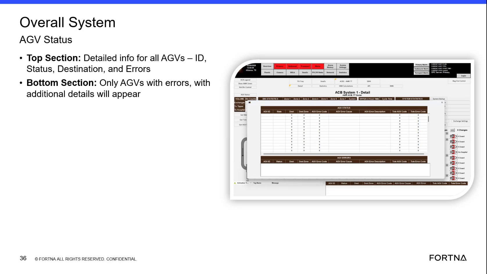

# Review Fleet Status On the Overall System AGV Status Screen

## Runbook Header

| Field | Value |
| --- | --- |
| Procedure ID | `proc_review_fleet_status_on_the_overall_system_agv_status_screen_v1` |
| Title | Review Fleet Status On the Overall System AGV Status Screen |
| Procedure Type | `diagnostic` |
| Primary Role | `L1_support` |
| Supporting Roles | None |
| Support Safe | Yes |
| Validation Status | `needs_sme_review` |
| Merge Status | `source_finalized` |

## Summary

Use the Overall System AGV Status screen to review fleet-wide AGV information. The source describes a top section with detailed information for all AGVs and a bottom section that shows only AGVs with errors, allowing the user to identify AGVs currently reported with errors.

## When To Use

Use when reviewing fleet-level AGV status and identifying which AGVs are currently shown with errors on the Overall System AGV Status screen.

## Do Not Use For

* Correcting AGV faults or performing recovery actions, because this source only supports status review.
* Using fields or controls beyond ID, Status, Destination, and Errors, because no additional screen interactions are supported by this source.

## Safety And Operational Notes

* This source supports a screen-based review procedure only.
* Do not infer corrective actions, control actions, or system changes from this source.

## Access Or Tools Needed

* Access to the Overall System AGV Status screen
* Visibility of AGV fields for ID, Status, Destination, and Errors

## Related Operational Context

* ctx_training_video_overall_system_agv_status_screen_v1
* ctx_training_video_agv_status_top_section_fields_v1
* ctx_training_video_agv_error_bottom_section_v1

## Procedure Steps

### Step 1 — Open the Overall System AGV Status screen

**Responsible role:** L1_support

**Instruction:**
Open or navigate to the screen labeled "Overall System AGV Status."

**Expected result:**
The Overall System AGV Status screen is visible.

**Screens / Images:**

*The "Overall System AGV Status" heading and the two-section layout.*

**Stop or Escalate If:**

* Escalate if the screen is unavailable.
* Escalate if the AGV information needed is not visible.

---

### Step 2 — Review the top section for all AGVs

**Responsible role:** L1_support

**Instruction:**
Review the top section, which shows detailed information for all AGVs.

**Expected result:**
The top section displays the fleet-wide AGV detail area.

**Screens / Images:**

*The top section identified as the detailed information area for all AGVs.*

**Stop or Escalate If:**

* Escalate if the AGV information needed is not visible.

---

### Step 3 — Check AGV detail fields in the top section

**Responsible role:** L1_support

**Instruction:**
For each AGV entry, check the fields listed by the source: ID, Status, Destination, and Errors.

**Expected result:**
Each AGV entry is reviewed using the documented fields.

**Screens / Images:**

*The AGV detail fields in the top section: ID, Status, Destination, and Errors.*

**Stop or Escalate If:**

* Escalate if an AGV appears to have an error but the displayed information is unclear from the documented fields in this source.
* Escalate if the AGV information needed is not visible.

---

### Step 4 — Review the bottom section for AGVs with errors

**Responsible role:** L1_support

**Instruction:**
Review the bottom section, which is dedicated to only AGVs with errors.

**Expected result:**
The bottom section shows the AGVs currently listed with errors.

**Screens / Images:**

*The lower section of the screen showing only AGVs with errors.*

**Stop or Escalate If:**

* Escalate if the AGV information needed is not visible.

---

### Step 5 — Identify AGVs currently reported with errors

**Responsible role:** L1_support

**Instruction:**
Compare the AGVs shown in the bottom section against the detailed information visible in the top section to identify which AGVs currently have reported errors.

**Expected result:**
The AGVs currently shown with errors are identified.

**Screens / Images:**

*Use the top section AGV details together with the bottom section error-only list to identify AGVs with reported errors.*

**Stop or Escalate If:**

* Escalate if an AGV appears to have an error but the displayed information is unclear from the documented fields in this source.

---

## Success Criteria

* The Overall System AGV Status screen is visible.
* The user can review the top section for all AGVs.
* The user can review ID, Status, Destination, and Errors for AGV entries.
* The user can identify which AGVs are currently listed with errors using the bottom section.

## Failure Conditions

* The Overall System AGV Status screen is unavailable.
* The AGV information needed is not visible.
* The documented AGV fields are unclear from the screen.
* An AGV appears to have an error but the displayed information is unclear from the documented fields in this source.

## Escalation Guidance

* Escalate if the screen is unavailable or the AGV information needed is not visible.
* Escalate if an AGV appears to have an error but the displayed information is unclear from the documented fields in this source.

## Missing Details / Known Gaps

* The source does not describe how to navigate to the Overall System AGV Status screen.
* The source does not define any corrective action after identifying AGVs with errors.
* The source does not provide thresholds, error interpretation rules, or escalation contacts.
* The source does not provide a time estimate for completing this review.

## Source Lineage

- Candidate IDs: candidate_training_video_review_overall_system_agv_status_screen
- Source ID: `training_video_day1`
- Source Type: `training_video`
