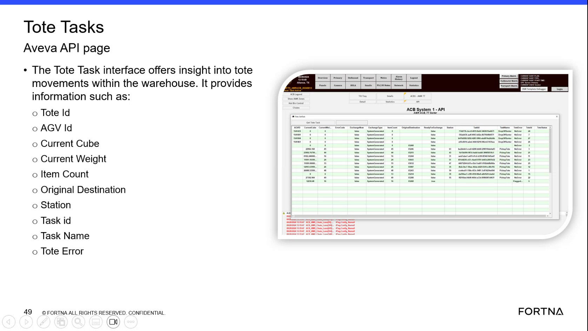

# Review Tote Task Details In the Tote Task Interface

## Runbook Header

| Field | Value |
| --- | --- |
| Procedure ID | `proc_review_tote_task_details_in_the_tote_task_interface_v1` |
| Title | Review Tote Task Details In the Tote Task Interface |
| Procedure Type | `diagnostic` |
| Primary Role | `L1_support` |
| Supporting Roles | None |
| Support Safe | Yes |
| Validation Status | `needs_sme_review` |
| Merge Status | `source_finalized` |

## Summary

Use the Tote Task interface in the Aveva API page to inspect the current tote task and capture the tote, AGV, destination, station, task identifiers, task name, and any tote error shown for tote movement tracking.

## When To Use

Use when you need to view current tote task information in the Tote Task interface and identify the displayed tote movement and task-related fields.

## Do Not Use For

* Do not use to infer missing values or meanings that are not shown in the interface.
* Do not use when required task fields are not visible or cannot be interpreted from the interface.

## Safety And Operational Notes

* This is a screen-based review procedure supported as safe in the source packet.
* Do not infer values or meanings that are not explicitly shown in the interface.

## Access Or Tools Needed

* Access to the Tote Task interface
* Visibility of the Aveva API Tote Task page

## Related Operational Context

* ctx_training_video_tote_task_interface_overview_v1
* ctx_training_video_tote_task_data_fields_v1
* ctx_training_video_tote_error_field_reference_v1

## Procedure Steps

### Step 1 — Open or view the Tote Task interface

**Responsible role:** L1_support

**Instruction:**
Open or view the Tote Task interface in the Aveva API page.

**Expected result:**
The Tote Task interface is visible.

**Screens / Images:**

*Tote Tasks Aveva API page and the listed task detail fields.*

**Stop or Escalate If:**

* Required task fields are not visible.
* The interface cannot be interpreted from the available view.

---

### Step 2 — Identify the current task information

**Responsible role:** L1_support

**Instruction:**
Identify the current task information shown for the tote.

**Expected result:**
The current task information for the tote is identified on the interface.

**Screens / Images:**

*Current task details area on the Tote Tasks Aveva API page.*

**Stop or Escalate If:**

* Current task information is not visible.
* Current task information cannot be interpreted from the interface.

---

### Step 3 — Read Tote ID and AGV ID

**Responsible role:** L1_support

**Instruction:**
Read the Tote ID and AGV ID fields to identify the tote and associated vehicle.

**Expected result:**
The displayed Tote ID and AGV ID are identified.

**Screens / Images:**

*Tote ID and AGV ID fields on the Tote Task interface.*

**Stop or Escalate If:**

* Tote ID is not visible.
* AGV ID is not visible.
* The identifiers cannot be interpreted from the interface.

---

### Step 4 — Check Original Destination and Station

**Responsible role:** L1_support

**Instruction:**
Check the Original Destination and Station fields to see where the tote is assigned and what station it is at.

**Expected result:**
The displayed Original Destination and Station values are identified.

**Screens / Images:**

*Original Destination and Station fields on the Tote Task interface.*

**Stop or Escalate If:**

* Original Destination is not visible.
* Station is not visible.
* The displayed values cannot be interpreted.

---

### Step 5 — Review task identifiers and task name

**Responsible role:** L1_support

**Instruction:**
Review the Task ID, sorter task UID if shown, and Task Name fields to identify the active task record.

**Expected result:**
The displayed Task ID, sorter task UID if present, and Task Name are identified.

**Screens / Images:**

*Task ID, sorter task UID reference if shown, and Task Name fields.*

**Stop or Escalate If:**

* Task ID is not visible.
* Task Name is not visible.
* The task record cannot be interpreted from the interface.

---

### Step 6 — Check the Tote Error field

**Responsible role:** L1_support

**Instruction:**
Check the Tote Error field to see whether an error is shown for the tote.

**Expected result:**
Any displayed tote error information is identified.

**Screens / Images:**

*Tote Error field on the Tote Task interface.*

**Stop or Escalate If:**

* The Tote Error field is not visible.
* The Tote Error field cannot be interpreted.

---

### Step 7 — Record displayed values exactly as shown

**Responsible role:** L1_support

**Instruction:**
Record the displayed values exactly as shown in the interface.

**Expected result:**
The displayed Tote ID, AGV ID, destination, station, task identifiers, task name, and any tote error are captured exactly as shown.

**Screens / Images:**

*All displayed tote task fields to transcribe exactly as shown.*

**Stop or Escalate If:**

* Required task fields are not visible.
* Displayed values cannot be interpreted confidently from the interface.
* Recording the values would require inference.

---

## Success Criteria

* The Tote Task interface is visible.
* The current tote task information is identified.
* Displayed values for Tote ID, AGV ID, Original Destination, Station, Task ID, Task Name, and Tote Error are captured exactly as shown.
* Sorter task UID is captured if shown on the interface.

## Failure Conditions

* Required task fields are not visible.
* Displayed values cannot be interpreted from the interface.
* The user would need to infer missing values or meanings.

## Escalation Guidance

* Escalate if required task fields are not visible or cannot be interpreted from the interface.
* Do not infer missing values or meanings that are not shown in the source-backed interface.

## Missing Details / Known Gaps

* The source does not provide detailed navigation steps for reaching the Tote Task interface beyond referencing the Aveva API page.
* The source does not provide a time estimate for completing this review.
* The source does not define exact escalation destination or contact path.
* The source does not specify whether production stop or LOTO is required; this appears to be a view-only procedure.

## Source Lineage

- Candidate IDs: candidate_training_video_review_tote_task_details
- Source ID: `training_video_day1`
- Source Type: `training_video`
