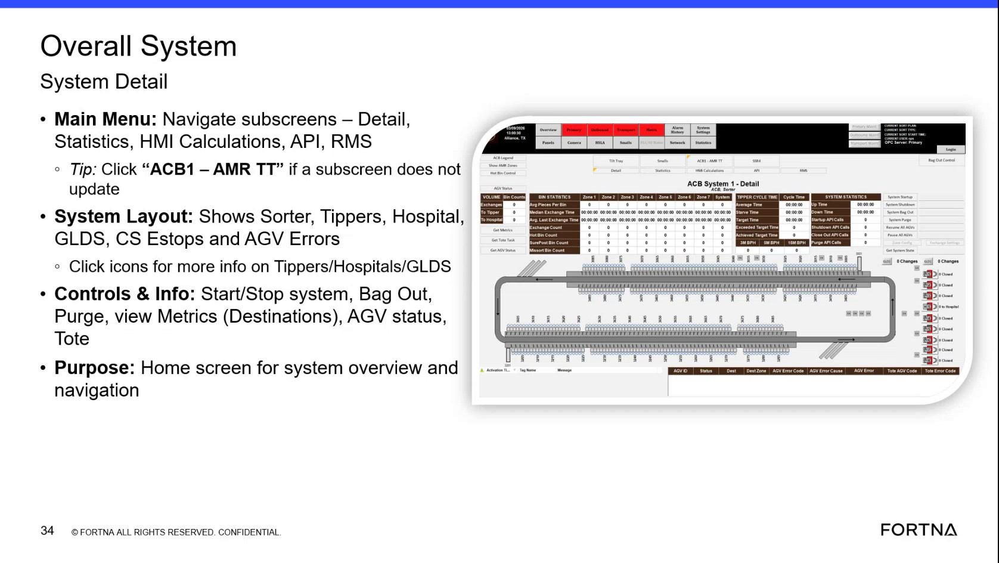

# Run a Pre Bag Out Exchange for the Lowest 25 Percent of Destinations per Sorter Leg

## Runbook Header

| Field | Value |
| --- | --- |
| Procedure ID | `proc_run_a_pre_bag_out_exchange_for_the_lowest_25_percent_of_destinations_per_sorter_leg_v1` |
| Title | Run a Pre Bag Out Exchange for the Lowest 25 Percent of Destinations per Sorter Leg |
| Procedure Type | `operation` |
| Primary Role | `operator` |
| Supporting Roles | None |
| Support Safe | Yes |
| Validation Status | `needs_sme_review` |
| Merge Status | `source_finalized` |

## Summary

Use the pre bag out function in the bag out control area to exchange the lowest 25 percent of destinations on each sorter leg before a full bag out. The source defines the pre bag out behavior and references bag out control screens, but does not provide the exact interface click sequence.

## When To Use

Use when an operator needs to perform a pre bag out action and the intended behavior is to exchange the lowest 25 percent of destinations on each sorter leg.

## Do Not Use For

* Do not use this runbook as instructions for a full system bag out; the source distinguishes pre bag out from system bag out that closes all destinations and exchanges all totes with parcels in them.
* Do not use this runbook when an exact interface sequence or destination-selection display method is required; the source does not define those details.

## Safety And Operational Notes

* The source provides operational behavior only and does not specify lockout/tagout, production stop, or other safety isolation requirements.
* Do not assume this procedure is the same as a full system bag out; the source explicitly distinguishes the two behaviors.

## Access Or Tools Needed

* Access to the bag out control system
* Visibility to destination or exchange activity by sorter leg

## Related Operational Context

* ctx_training_video_pre_bag_out_exchange_threshold_v1

## Procedure Steps

### Step 1 — Open bag out control and identify pre bag out

**Responsible role:** operator

**Instruction:**
Access the bag out control system from the overall system interface and identify the pre bag out function within the bag out control area.

**Expected result:**
The operator can see the bag out control area and identify the pre bag out option.

**Screens / Images:**

*Main overview screen showing bag out among the right-hand side controls.*

*Bag out control reference describing pre bag out and its lowest-25-percent-per-leg behavior.*

**Stop or Escalate If:**

* Bag out control is not accessible.
* The pre bag out option cannot be identified from the available interface or source-supported screen references.

---

### Step 2 — Start pre bag out

**Responsible role:** operator

**Instruction:**
Start the pre bag out action from the bag out control area.

**Expected result:**
The system begins the pre bag out action.

**Screens / Images:**

*Bag out control reference where pre bag out is described as an available option.*

**Stop or Escalate If:**

* The pre bag out action cannot be started.
* The system behavior after initiation does not appear to match the documented pre bag out behavior.

---

### Step 3 — Apply the documented pre bag out rule

**Responsible role:** operator

**Instruction:**
Use the documented rule that pre bag out exchanges the lowest 25 percent of destinations on each sorter leg.

**Expected result:**
The operator understands that pre bag out scope is limited to the lowest 25 percent of destinations per sorter leg.

**Screens / Images:**

*Text stating that pre-bag-out exchanges the lowest 25% of destinations per leg of the sorter.*

**Stop or Escalate If:**

* Observed behavior does not align with the documented lowest 25 percent of destinations per sorter leg rule.

---

### Step 4 — Observe exchange activity for included destinations

**Responsible role:** operator

**Instruction:**
Observe exchange activity for destinations included in the lowest 25 percent on each sorter leg.

**Expected result:**
Exchange activity is observed for destinations that fall within the documented pre bag out scope.

**Screens / Images:**

*Reference slide describing the expected pre bag out scope for comparison with observed behavior.*

**Stop or Escalate If:**

* Observed pre bag out behavior does not align with the documented lowest 25 percent per sorter leg rule.
* The system does not define or display which destinations are included in the 25 percent, preventing confirmation.

---

### Step 5 — Confirm the action was pre bag out and not full bag out

**Responsible role:** operator

**Instruction:**
Record or confirm that the action performed was pre bag out rather than a full system bag out.

**Expected result:**
The operator confirms the action matched pre bag out behavior and not full system bag out behavior.

**Screens / Images:**

*Pre bag out description contrasted with overall system bag out behavior on the same training reference.*

**Stop or Escalate If:**

* The action appears to have closed all destinations and exchanged all totes with parcels in them, indicating full system bag out behavior rather than pre bag out.
* The operator cannot confirm whether pre bag out or full bag out was performed.

---

## Success Criteria

* Pre bag out is initiated from the bag out control area.
* The resulting behavior matches the documented rule: exchange of the lowest 25 percent of destinations on each sorter leg.
* The action is confirmed as pre bag out rather than a full system bag out.

## Failure Conditions

* Pre bag out cannot be located or started.
* Observed behavior does not align with the documented lowest 25 percent per sorter leg rule.
* The available interface does not make it possible to determine which destinations are included in the 25 percent.
* The action appears to behave like a full system bag out instead of pre bag out.

## Escalation Guidance

* Escalate if the observed pre bag out behavior does not align with the documented lowest 25 percent per sorter leg rule.
* Escalate if the interface does not provide enough information to determine which destinations are included in the 25 percent.
* Escalate if the action appears to perform a full system bag out instead of pre bag out.

## Missing Details / Known Gaps

* The source does not provide the exact interface sequence for starting pre bag out.
* The source does not define how the system displays which destinations are included in the lowest 25 percent.
* The source does not provide a time estimate for completing pre bag out.
* The source does not specify production-stop or lockout/tagout requirements for this action.

## Source Lineage

- Candidate IDs: candidate_training_video_run_pre_bag_out_exchange
- Source ID: `training_video_day1`
- Source Type: `training_video`
