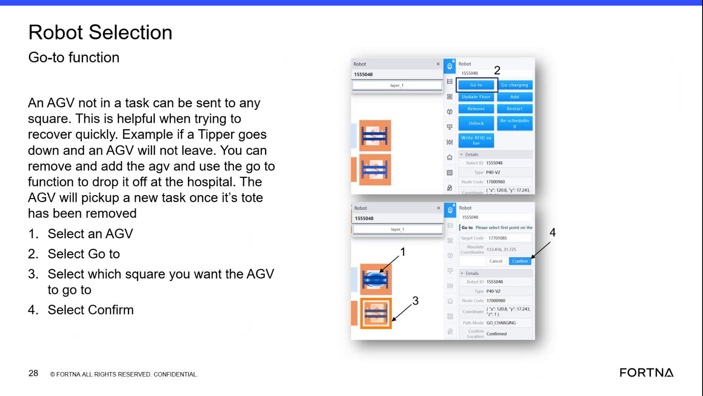

# Send an AGV Not in a Task to a Selected Square Using Go-to

## Runbook Header

| Field | Value |
| --- | --- |
| Procedure ID | `proc_send_an_agv_not_in_a_task_to_a_selected_square_using_go_to_v1` |
| Title | Send an AGV Not in a Task to a Selected Square Using Go-to |
| Procedure Type | `operation` |
| Primary Role | `L1_support` |
| Supporting Roles | None |
| Support Safe | Yes |
| Validation Status | `needs_sme_review` |
| Merge Status | `source_finalized` |

## Summary

Use the Robot Selection Go-to function to send an AGV that is not currently in a task to a selected square. The source provides a short sequence: select the AGV, select Go to, select the destination square, and confirm.

## When To Use

Use this procedure when an AGV is not in a task and needs to be manually sent to a selected square using the Robot Selection Go-to function.

## Do Not Use For

* Do not use this procedure for an AGV that is currently in a task.

## Safety And Operational Notes

* The source limits this function to an AGV not in a task.
* The source describes this as useful for quick recovery.

## Access Or Tools Needed

* Access to the Robot Selection screen
* Ability to select an AGV
* Go to function
* Destination square selection
* Confirm control

## Related Operational Context

* ctx_training_video_agv_not_in_task_go_to_constraint_v1

## Procedure Steps

### Step 1 — Open Robot Selection and identify the AGV

**Responsible role:** L1_support

**Instruction:**
Open the Robot Selection screen and identify the AGV you want to move.

**Expected result:**
The Robot Selection screen is open and the target AGV has been identified.

**Screens / Images:**

*Robot Selection Go-to slide showing the AGV movement workflow.*

**Stop or Escalate If:**

* The Robot Selection screen cannot be accessed.
* The AGV cannot be identified.

---

### Step 2 — Verify the AGV is not in a task

**Responsible role:** L1_support

**Instruction:**
Verify the AGV is not in a task before using Go-to.

**Expected result:**
The AGV is confirmed to be not in a task.

**Screens / Images:**

*Slide text stating that an AGV not in a task can be sent to any square.*

**Stop or Escalate If:**

* The AGV is currently in a task.

---

### Step 3 — Select the AGV

**Responsible role:** L1_support

**Instruction:**
Select the AGV.

**Expected result:**
The intended AGV is selected in Robot Selection.

**Screens / Images:**

*The Robot Selection Go-to workflow showing AGV selection as the first step.*

**Stop or Escalate If:**

* The AGV cannot be selected.

---

### Step 4 — Select Go to

**Responsible role:** L1_support

**Instruction:**
Select Go to.

**Expected result:**
The Go-to function is opened for the selected AGV.

**Screens / Images:**

*The Go-to function step in the Robot Selection workflow.*

**Stop or Escalate If:**

* The Go-to option is unavailable.

---

### Step 5 — Select the destination square

**Responsible role:** L1_support

**Instruction:**
Select the square you want the AGV to go to.

**Expected result:**
A destination square is selected for the AGV.

**Screens / Images:**

*The destination square selection step in the Go-to workflow.*

**Stop or Escalate If:**

* The destination square cannot be selected.

---

### Step 6 — Confirm the Go-to action

**Responsible role:** L1_support

**Instruction:**
Select Confirm.

**Expected result:**
The Go-to action is confirmed and the AGV is sent to the selected square.

**Screens / Images:**

*The final Confirm step in the Robot Selection Go-to workflow.*

**Stop or Escalate If:**

* The Confirm control is unavailable.
* The AGV does not move after confirmation.

---

## Success Criteria

* The selected AGV is sent to the chosen square.
* The Go-to action is accepted after confirmation.

## Failure Conditions

* The AGV is in a task.
* The AGV cannot be selected.
* The Go-to option is unavailable.
* The destination square cannot be selected.
* The AGV does not move after confirmation.

## Escalation Guidance

* Do not use this procedure if the AGV is in a task, because the source limits the Go-to function to an AGV not in a task.
* Escalate if the AGV cannot be selected, the Go-to option is unavailable, or the AGV does not move after confirmation.

## Missing Details / Known Gaps

* The source does not provide a time estimate.
* The source does not specify permissions beyond access to Robot Selection.
* The source does not provide detailed UI indicators for how to verify task state.
* The source does not provide additional safety checks, production stop requirements, or LOTO requirements.

## Source Lineage

- Candidate IDs: candidate_training_video_send_agv_to_selected_square_with_go_to
- Source ID: `training_video_day1`
- Source Type: `training_video`
