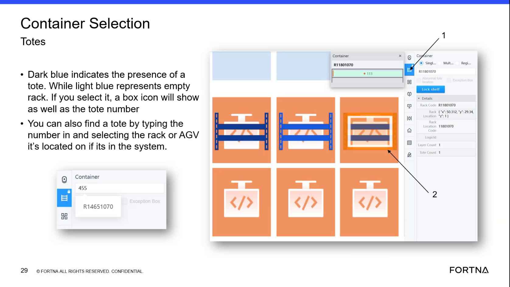

# Send An AGV To A Selected Square Using The Go-to Function

## Runbook Header

| Field | Value |
| --- | --- |
| Procedure ID | `proc_send_an_agv_to_a_selected_square_using_the_go_to_function_v1` |
| Title | Send An AGV To A Selected Square Using The Go-to Function |
| Procedure Type | `operation` |
| Primary Role | `L1_support` |
| Supporting Roles | None |
| Support Safe | Yes |
| Validation Status | `needs_sme_review` |
| Merge Status | `source_finalized` |

## Summary

Use the Robot Selection Go-to function to send an AGV that is not in a task to a selected square. The training source shows a short sequence: select the AGV, select Go to, choose the destination square, and confirm.

## When To Use

Use when an AGV is not in a task and needs to be sent to a selected square using the Go-to function shown in the training source. The source also frames this as helpful for quick recovery or repositioning scenarios.

## Do Not Use For

* Do not use this procedure if the AGV is in a task, because the source only describes Go-to for an AGV not in a task.

## Safety And Operational Notes

* Use only for an AGV not in a task.
* The source frames this function as useful for quick recovery; no lockout, production stop, or additional safety controls are stated in the source.

## Access Or Tools Needed

* Access to the robot or object selection interface
* Ability to select an AGV object
* Go to function in the interface
* Destination square selection and Confirm control

## Related Operational Context

* ctx_training_video_agv_object_selection_v1

## Procedure Steps

### Step 1 — Select the AGV object in the interface

**Responsible role:** L1_support

**Instruction:**
Open the robot or object selection view and select the AGV object. Under AGV, select the AGV so the interface shows AGV information.

**Expected result:**
The AGV is selected and AGV information is displayed.

**Screens / Images:**

*AGV object selection area and the AGV information area referenced in the training segment.*

**Stop or Escalate If:**

* The AGV cannot be selected.
* AGV information does not display after selection.

---

### Step 2 — Verify the AGV is not in a task

**Responsible role:** L1_support

**Instruction:**
Before using Go to, verify the selected AGV is not in a task.

**Expected result:**
The AGV is confirmed to be not in a task and is eligible for the Go-to function described in the source.

**Screens / Images:**

*Slide text stating that an AGV not in a task can be sent to any square.*

**Stop or Escalate If:**

* The AGV is in a task.
* The interface does not provide enough information to determine whether the AGV is in a task.

---

### Step 3 — Select the Go to function

**Responsible role:** L1_support

**Instruction:**
Select the Go to function or button for the selected AGV.

**Expected result:**
The Go-to control is activated and the interface is ready for destination selection.

**Screens / Images:**

*The Go to control shown in the Robot Selection training slide.*

**Stop or Escalate If:**

* The Go to action is not available.
* The Go to action cannot be selected from the available interface.

---

### Step 4 — Select the destination square

**Responsible role:** L1_support

**Instruction:**
Select which square you want the AGV to go to.

**Expected result:**
A destination square is selected for the AGV.

**Screens / Images:**

*The step list on the training slide showing destination square selection.*

**Stop or Escalate If:**

* A destination square cannot be selected.
* The intended square cannot be identified in the interface.

---

### Step 5 — Confirm the Go-to action

**Responsible role:** L1_support

**Instruction:**
Select Confirm to send the AGV to the chosen square.

**Expected result:**
The Go-to action is confirmed and the selected AGV is sent to the chosen square.

**Screens / Images:**

*The final Confirm step shown on the Robot Selection Go-to training slide.*

**Stop or Escalate If:**

* The Go-to action cannot be confirmed.
* The AGV is not sent after confirmation.

---

## Success Criteria

* The selected AGV is sent to the chosen square using the Go-to function.
* The Go-to sequence can be completed by selecting the AGV, selecting Go to, choosing a square, and confirming.

## Failure Conditions

* The AGV is in a task.
* The AGV cannot be selected.
* AGV information does not display after selection.
* The Go to control is unavailable or cannot be selected.
* A destination square cannot be selected.
* The Go-to action cannot be confirmed.
* The AGV is not sent after confirmation.

## Escalation Guidance

* Do not proceed if the AGV is in a task; the source only supports this procedure for an AGV not in a task.
* Escalate if the AGV cannot be selected, AGV information does not display after selection, or the Go-to action cannot be confirmed from the available interface.

## Missing Details / Known Gaps

* The source does not specify the exact screen name beyond robot or object selection context.
* The source does not provide exact AGV status fields or values to use when verifying the AGV is not in a task.
* The source does not provide a time estimate.
* The source does not specify whether production stop or LOTO is required.
* The source does not provide exact button labels beyond 'Go to' and 'Confirm' or any command-line/API equivalents.

## Source Lineage

- Candidate IDs: candidate_training_video_send_agv_to_square_with_go_to
- Source ID: `training_video_day1`
- Source Type: `training_video`
