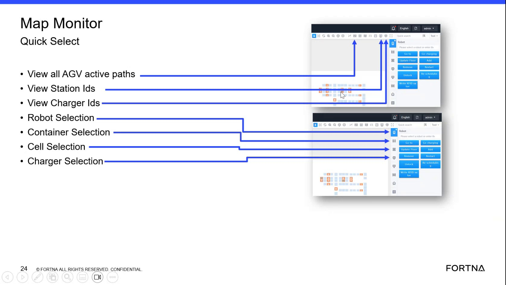

# Send An AGV That Is Not In A Task To A Selected Map Square Using Go To

## Runbook Header

| Field | Value |
| --- | --- |
| Procedure ID | `proc_send_an_agv_that_is_not_in_a_task_to_a_selected_map_square_using_go_to_v1` |
| Title | Send An AGV That Is Not In A Task To A Selected Map Square Using Go To |
| Procedure Type | `operation` |
| Primary Role | `operator` |
| Supporting Roles | None |
| Support Safe | Yes |
| Validation Status | `needs_sme_review` |
| Merge Status | `source_finalized` |

## Summary

Use the Robot Selection Go-to function in the OptiSweep map view to send an AGV that is not currently in a task to a selected square. The source emphasizes that the user must select an AGV object first; clicking the map background alone does not perform an action.

## When To Use

Use this procedure when an operator needs to reposition an AGV on the map using the Go to function and the AGV is not in a task.

## Do Not Use For

* Do not use this procedure for an AGV that is currently in a task.
* Do not use a generic map click by itself as the selection action, because the source states that clicking the map alone does nothing.

## Safety And Operational Notes

* Only use the Go-to function for an AGV that is not in a task, as stated by the source.
* If clicking the map does nothing, verify that an AGV object or other selectable object was selected rather than the map background.

## Access Or Tools Needed

* Access to the OptiSweep map screen
* Ability to select AGV objects on the map
* Go to function
* Confirm control

## Related Operational Context

* ctx_training_video_map_selectable_objects_v1
* ctx_training_video_robot_selection_go_to_function_v1

## Procedure Steps

### Step 1 — Select the AGV object on the map

**Responsible role:** operator

**Instruction:**
On the map, select the AGV object you want to move. Do not click only on an empty area of the map.

**Expected result:**
The AGV is selected as the active object for further actions.

**Screens / Images:**

*Map-related training slide and nearby explanation that selectable objects include AGVs and cells, and that clicking the map alone does nothing.*

**Stop or Escalate If:**

* Clicking the map does nothing after the attempted selection.
* The AGV cannot be selected on the map.

---

### Step 2 — Verify the AGV is not in a task

**Responsible role:** operator

**Instruction:**
Before continuing, verify that the selected AGV is not in a task.

**Expected result:**
The AGV is confirmed to be eligible for the Go-to function.

**Screens / Images:**

*Slide statement that an AGV not in a task can be sent to any square.*

**Stop or Escalate If:**

* The AGV is currently in a task.

---

### Step 3 — Select Go to

**Responsible role:** operator

**Instruction:**
From the AGV selection options, select Go to.

**Expected result:**
The Go-to function is selected for the chosen AGV.

**Screens / Images:**

*Robot Selection Go-to function slide showing Go to as the second step after selecting an AGV.*

**Stop or Escalate If:**

* Go to is not available after selecting the AGV.

---

### Step 4 — Select the destination square

**Responsible role:** operator

**Instruction:**
Select the square on the map where you want the AGV to go.

**Expected result:**
A destination square is chosen for the AGV.

**Screens / Images:**

*Go-to workflow step indicating selection of the square the AGV should go to.*

**Stop or Escalate If:**

* The destination square cannot be selected.

---

### Step 5 — Confirm the move

**Responsible role:** operator

**Instruction:**
Select Confirm to send the AGV to the chosen square.

**Expected result:**
The AGV is sent to the selected square on the map.

**Screens / Images:**

*Go-to workflow step showing Confirm as the final action.*

**Stop or Escalate If:**

* Confirm does not send the AGV to the selected square.

---

## Success Criteria

* The selected AGV is sent to the chosen square on the map using the Go to function.
* The AGV was selected as an object rather than attempting to act on the map background.

## Failure Conditions

* Clicking the map does nothing because no AGV object was selected.
* The selected AGV is in a task.
* The Go to option is unavailable after selection.
* The destination square cannot be selected.
* Confirm does not send the AGV to the chosen square.

## Escalation Guidance

* If clicking the map does nothing, ensure an AGV object has been selected rather than the map background.
* Stop using this procedure if the AGV is in a task, because the source limits the function to an AGV not in a task.

## Missing Details / Known Gaps

* The source does not specify how the operator verifies that the AGV is not in a task.
* The source does not provide a time estimate for completing the procedure.
* The source does not specify whether production stop or LOTO is required.
* The source does not provide explicit UI field names beyond Go to and Confirm.

## Source Lineage

- Candidate IDs: candidate_training_video_send_idle_agv_to_map_square
- Source ID: `training_video_day1`
- Source Type: `training_video`
