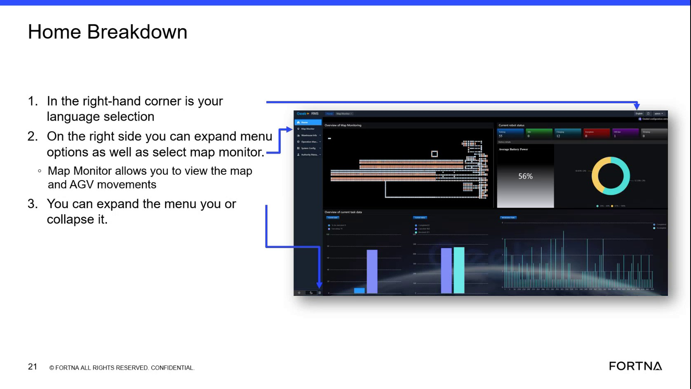

# Switch the RMS Interface Language to English

## Runbook Header

| Field | Value |
| --- | --- |
| Procedure ID | `proc_switch_the_rms_interface_language_to_english_v1` |
| Title | Switch the RMS Interface Language to English |
| Procedure Type | `operation` |
| Primary Role | `operator` |
| Supporting Roles | None |
| Support Safe | Yes |
| Validation Status | `needs_sme_review` |
| Merge Status | `source_finalized` |

## Summary

Use the RMS language selection control in the top-right corner of the RMS interface to change the displayed language from Chinese to English.

## When To Use

Use this procedure when the RMS interface is visible and the displayed language is Chinese, and the operator needs to switch the interface to English using the top-right language selection control.

## Do Not Use For

* Do not use this procedure if the language selection control cannot be confidently identified on the visible RMS screen.
* Do not use this procedure to perform other RMS navigation or configuration changes beyond switching the interface language to English.

## Safety And Operational Notes

* If the language selection control cannot be identified from the visible screen, stop and request guidance rather than guessing.

## Access Or Tools Needed

* Access to the RMS application
* Visible RMS home screen or top navigation area

## Related Operational Context

* ctx_training_video_rms_home_navigation_overview_v1
* ctx_training_video_rms_language_selection_reference_v1

## Procedure Steps

### Step 1 — Locate the language selection control

**Responsible role:** operator

**Instruction:**
Look at the top-right corner of the RMS application and locate the language selection control. Use the source guidance that this is the third icon from the right.

**Expected result:**
The operator identifies the language selection control in the top-right corner of the RMS interface.

**Screens / Images:**

*Top-right corner of the RMS home screen and the language selection control position described as the third icon from the right.*

**Stop or Escalate If:**

* Stop and request guidance if the language selection control cannot be identified from the visible screen.

---

### Step 2 — Click the language selection control

**Responsible role:** operator

**Instruction:**
Click the language selection control in the top-right corner of the RMS interface.

**Expected result:**
The language selection control responds and allows the operator to proceed with changing the displayed language.

**Screens / Images:**

*The top-right language selection control referenced by the training slide and transcript.*

**Stop or Escalate If:**

* Escalate for additional support if clicking the control does not allow switching to English.

---

### Step 3 — Switch the interface to English

**Responsible role:** operator

**Instruction:**
Use the language selection control to switch the displayed language to English.

**Expected result:**
The RMS interface language changes to English.

**Stop or Escalate If:**

* Escalate for additional support if the control does not allow switching to English.
* Stop if the interface does not change to English after the selection attempt.

---

## Success Criteria

* The RMS interface language changes to English.
* The operator can view the RMS interface in English after using the top-right language selection control.

## Failure Conditions

* The language selection control cannot be identified from the visible screen.
* Clicking the language selection control does not allow switching to English.
* The interface does not change to English after the selection attempt.

## Escalation Guidance

* If the language selection control cannot be identified from the visible screen, stop and request guidance rather than guessing.
* If clicking the control does not allow switching to English, escalate for additional support.

## Missing Details / Known Gaps

* The source does not provide the exact label text or icon graphic for the language selection control.
* The source does not describe any intermediate menu, dropdown, or confirmation behavior after clicking the control.
* The source does not provide an estimated completion time.
* The source does not specify whether production stop or LOTO considerations apply.

## Source Lineage

- Candidate IDs: candidate_training_video_switch_rms_interface_language_to_english
- Source ID: `training_video_day1`
- Source Type: `training_video`
