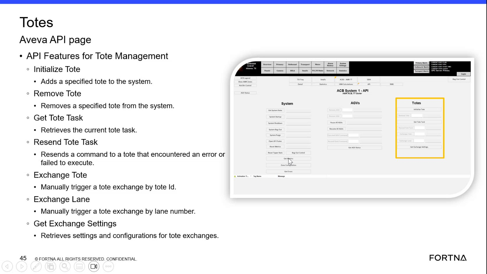

# Manually Trigger A Tote Exchange By Tote ID Or Lane Number

## Runbook Header

| Field | Value |
| --- | --- |
| Procedure ID | `proc_manually_trigger_a_tote_exchange_by_tote_id_or_lane_number_v1` |
| Title | Manually Trigger A Tote Exchange By Tote ID Or Lane Number |
| Procedure Type | `operation` |
| Primary Role | `L2_support` |
| Supporting Roles | None |
| Support Safe | No |
| Validation Status | `needs_sme_review` |
| Merge Status | `source_finalized` |

## Summary

Use the documented tote management functions shown on the Aveva API page to manually trigger a tote exchange either by tote ID using "Exchange Tote" or by lane number using "Exchange Lane." The source supports identification of the two functions and their stated purpose, but does not provide parameter format, execution confirmation, or post-exchange validation details.

## When To Use

Use when authorized support personnel need to initiate a manual tote exchange and have either the tote ID or the lane number available, based on the documented Aveva API tote management functions shown in the source.

## Do Not Use For

* Do not use when the required tote ID or lane number is not available.
* Do not use when the Exchange Tote or Exchange Lane functions are not accessible.
* Do not use to infer parameter formats, confirmation behavior, or post-exchange validation steps, because those details are not provided in the source.

## Safety And Operational Notes

* This is a manual state-changing API action.
* The source does not provide execution guardrails or safe execution details.
* Do not invent parameter formats, confirmation behavior, or post-exchange validation steps not shown in the source.

## Access Or Tools Needed

* Access to the Aveva API page showing tote management functions
* Authorized ability to use Exchange Tote or Exchange Lane
* Tote ID or lane number, depending on the selected function

## Related Operational Context

* ctx_training_video_tote_api_exchange_functions_v1

## Procedure Steps

### Step 1 — Open or view the tote management API page

**Responsible role:** L2_support

**Instruction:**
Open or view the Aveva API page that lists tote management functions and confirm the tote management options are visible.

**Expected result:**
The Aveva API page is visible and includes tote management functions.

**Screens / Images:**

*API Features for Tote Management page showing Exchange Tote, Exchange Lane, and related tote functions.*

**Stop or Escalate If:**

* Escalate if the exchange functions are not accessible.

---

### Step 2 — Verify the Exchange Tote function

**Responsible role:** L2_support

**Instruction:**
Locate the function named "Exchange Tote" and verify that the displayed description says it manually triggers a tote exchange by tote ID.

**Expected result:**
The Exchange Tote function is identified as the tote-ID-based manual exchange option.

**Screens / Images:**

*The Exchange Tote entry on the API Features for Tote Management page.*

**Stop or Escalate If:**

* Escalate if the Exchange Tote function is not accessible.

---

### Step 3 — Verify the Exchange Lane function

**Responsible role:** L2_support

**Instruction:**
Locate the function named "Exchange Lane" and verify that the displayed description says it manually triggers a tote exchange by lane number.

**Expected result:**
The Exchange Lane function is identified as the lane-number-based manual exchange option.

**Screens / Images:**

*The Exchange Lane entry on the API Features for Tote Management page.*

**Stop or Escalate If:**

* Escalate if the Exchange Lane function is not accessible.

---

### Step 4 — Choose the exchange function that matches the available identifier

**Responsible role:** L2_support

**Instruction:**
Choose the documented exchange function that matches the identifier available to the support user, either tote ID or lane number.

**Expected result:**
The correct documented function is selected based on whether the available identifier is a tote ID or a lane number.

**Screens / Images:**

*The Exchange Tote and Exchange Lane options used to choose the function matching the available identifier.*

**Stop or Escalate If:**

* Escalate if the required tote ID or lane number is not available.

---

### Step 5 — Initiate the selected exchange function only with authorized access

**Responsible role:** L2_support

**Instruction:**
Use the selected exchange function only if authorized access to the API page is available.

**Expected result:**
The manual tote exchange is initiated using the selected documented function under authorized access.

**Screens / Images:**

*The selected Exchange Tote or Exchange Lane function on the Aveva API page.*

**Stop or Escalate If:**

* Escalate if the exchange functions are not accessible.
* Stop if authorized access to the API page is not available.

---

### Step 6 — Record which identifier type was used

**Responsible role:** L2_support

**Instruction:**
Record whether the manual tote exchange was initiated by tote ID or by lane number.

**Expected result:**
The exchange initiation method is documented as tote ID or lane number.

---

## Success Criteria

* A manual tote exchange is initiated using one of the documented API functions.
* The function used matches the available identifier type: tote ID for Exchange Tote or lane number for Exchange Lane.
* The initiation method is recorded as tote ID or lane number.

## Failure Conditions

* The required tote ID or lane number is not available.
* The Exchange Tote or Exchange Lane functions are not accessible.
* The source does not provide enough detail to confirm parameter format, confirmation behavior, or post-exchange validation.

## Escalation Guidance

* Escalate if the required tote ID or lane number is not available.
* Escalate if the exchange functions are not accessible.
* Escalate for SME review if execution requires parameter format, confirmation behavior, or post-exchange validation details not present in the source.

## Missing Details / Known Gaps

* The source does not provide parameter formats for Exchange Tote or Exchange Lane.
* The source does not provide confirmation behavior after initiating the exchange.
* The source does not provide post-exchange validation steps.
* The source does not provide explicit production stop or LOTO requirements.
* The source does not provide an execution time estimate.
* The source does not provide explicit role boundaries beyond inferred support access.

## Source Lineage

- Candidate IDs: candidate_training_video_trigger_tote_exchange_by_tote_id_or_lane
- Source ID: `training_video_day1`
- Source Type: `training_video`
