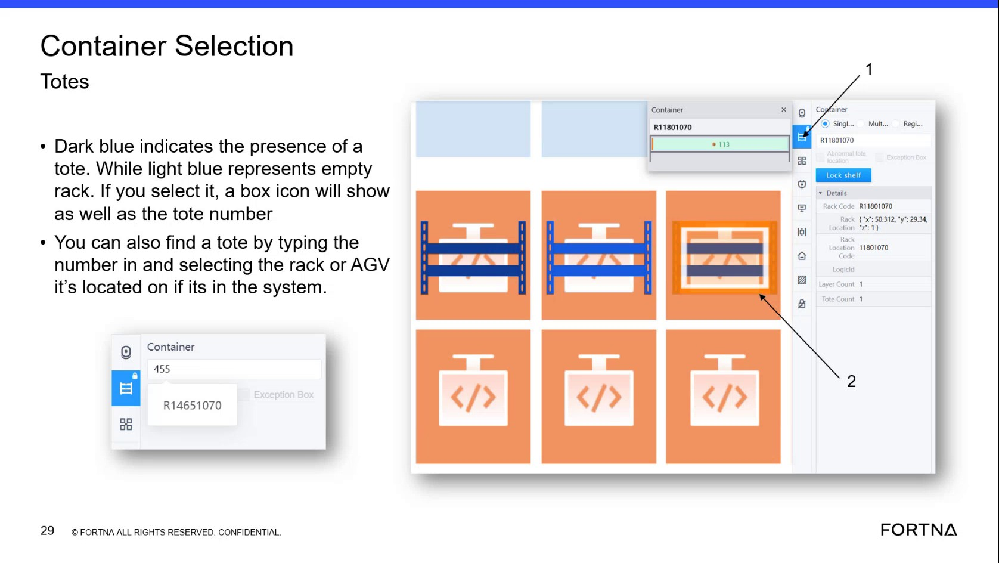

# Verify Whether The Logged-In User Has Restricted Access For AGV Removal Actions

## Runbook Header

| Field | Value |
| --- | --- |
| Procedure ID | `proc_verify_whether_the_logged_in_user_has_restricted_access_for_agv_removal_actions_v1` |
| Title | Verify Whether The Logged-In User Has Restricted Access For AGV Removal Actions |
| Procedure Type | `reference` |
| Primary Role | `L1_support` |
| Supporting Roles | None |
| Support Safe | Yes |
| Validation Status | `needs_sme_review` |
| Merge Status | `source_finalized` |

## Summary

Use this source-based check to confirm whether the current application session appears consistent with the training guidance that access is controlled by username and password, that not everybody has credentials, that operators do not have the credentials for this action, and that supervisors do. This is an access-verification procedure only and not an AGV removal procedure.

## When To Use

Use when reviewing whether a currently logged-in application session should have access to AGV removal-related controls or permissions, especially before any high-impact AGV action is attempted.

## Do Not Use For

* Do not use this runbook to perform AGV removal.
* Do not use this runbook as authorization to click AGV removal controls.
* Do not use this runbook when the user's role or expected permissions cannot be identified from available information.

## Safety And Operational Notes

* The source describes removing an AGV from an active system as one of the worst actions a user can do.
* Do not attempt AGV removal as part of this verification.
* Treat visible AGV removal capability as high impact and verify user appropriateness before any action is attempted.

## Access Or Tools Needed

* Access to the application login/session state
* Knowledge of the current user's role or expected permissions
* Visibility into AGV-related controls if present

## Related Operational Context

* ctx_training_video_role_access_agv_removal_permissions_v1
* ctx_training_video_safety_agv_removal_high_risk_v1

## Procedure Steps

### Step 1 — Confirm the session is tied to a logged-in user account

**Responsible role:** L1_support

**Instruction:**
Review the current application session and confirm that it is tied to a logged-in user account with a username and password, consistent with the source description.

**Expected result:**
The reviewer can confirm that the session is a credentialed login session rather than an unidentified or anonymous access state.

**Stop or Escalate If:**

* The session cannot be associated with a known logged-in user.
* A logged-in session appears to be left available for unauthorized use.

---

### Step 2 — Compare the current user's role to the stated access restriction

**Responsible role:** L1_support

**Instruction:**
Identify the current user's role or expected access level and compare it to the source statement that operators should not have credentials for this action while supervisors do.

**Expected result:**
The reviewer can determine whether the user's role is consistent with the source-described restriction.

**Stop or Escalate If:**

* An operator appears to have access to AGV removal actions.
* The user's role or expected permissions cannot be determined.

---

### Step 3 — Verify visible AGV-related controls are being viewed by an appropriate user

**Responsible role:** L1_support

**Instruction:**
If reviewing a screen with AGV-related controls, verify whether the logged-in user is someone who is expected to have that level of access before any high-impact action is attempted.

**Expected result:**
The reviewer confirms whether the visible AGV-related controls are being accessed by a user whose role is consistent with the source restriction.

**Screens / Images:**

*Application area where AGV-related controls are visible and the training context warning that AGV removal is high risk and access is credential-restricted.*

**Stop or Escalate If:**

* An operator appears to have access to AGV removal actions.
* A logged-in session is left available for unauthorized use.
* Anyone attempts or requests AGV removal as part of this verification.

---

### Step 4 — Record whether observed access aligns with the restriction

**Responsible role:** L1_support

**Instruction:**
Record whether the observed access aligns with the source-described restriction that not everybody has credentials.

**Expected result:**
A clear determination is documented stating whether the observed access is aligned or misaligned with the source guidance.

**Stop or Escalate If:**

* Observed access does not align with the source-described restriction.
* The reviewer cannot determine whether access is aligned.

---

## Success Criteria

* The current session is confirmed to be tied to a logged-in user account.
* The current user's role or expected access level is compared against the source statement.
* If AGV-related controls are visible, the reviewer confirms whether the logged-in user is appropriate for that access level.
* The outcome is recorded as aligned or not aligned with the source-described restriction.

## Failure Conditions

* An operator appears to have access to AGV removal actions.
* A logged-in session is left available for unauthorized use.
* The reviewer cannot determine the current user's role or whether the session is credentialed.
* The observed access does not align with the source-described restriction.

## Escalation Guidance

* Escalate if an operator appears to have access to AGV removal actions.
* Escalate if a logged-in session is left available for unauthorized use.
* Stop the verification and escalate if anyone attempts to use this check to justify removing an AGV.
* Escalate when the reviewer cannot determine whether the observed access is appropriate.

## Missing Details / Known Gaps

* The source does not provide a named application screen specifically dedicated to AGV removal access verification.
* The source does not define a formal permission matrix beyond stating that operators do not have credentials and supervisors do.
* The source does not specify the exact documentation location or system of record for recording the verification result.
* The source does not identify a specific escalation owner by name or team.

## Source Lineage

- Candidate IDs: candidate_training_video_verify_access_limits_for_agv_removal_actions
- Source ID: `training_video_day1`
- Source Type: `training_video`
