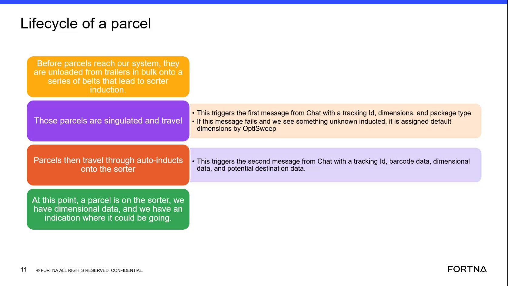

# Verify Parcel Data Elements Available As A Parcel Reaches The Sorter

## Runbook Header

| Field | Value |
| --- | --- |
| Procedure ID | `proc_verify_parcel_data_elements_available_as_a_parcel_reaches_the_sorter_v1` |
| Title | Verify Parcel Data Elements Available As A Parcel Reaches The Sorter |
| Procedure Type | `reference` |
| Primary Role | `L1_support` |
| Supporting Roles | None |
| Support Safe | Yes |
| Validation Status | `needs_sme_review` |
| Merge Status | `source_finalized` |

## Summary

Use the source-described parcel lifecycle and Chat message content to verify which parcel data elements should be available by the time a parcel is on the sorter. The source states that parcels move from belts leading to sorter induction, then a first Chat message provides tracking ID, dimensions, and package type, and a second Chat message provides tracking ID, barcode data, dimensional data, and potential destination data. At that point, the parcel is on the sorter with dimensional data and an indication of where it could be going.

## When To Use

Use this runbook when you need to confirm, based on the training source, which parcel data elements should be present by the time a parcel reaches sorter context.

## Do Not Use For

* Do not use this runbook to infer additional parcel fields beyond the source-listed data elements.
* Do not use this runbook to determine system navigation, commands, or screen workflows not provided by the source.
* Do not use this runbook to assign actual final destination logic beyond the source statement that there is potential destination data and an indication of where the parcel could be going.

## Safety And Operational Notes

* This is a source-based verification/reference procedure and is marked support safe in the candidate.
* Do not infer additional fields, destinations, or system actions beyond the data elements explicitly named in the source.

## Access Or Tools Needed

* Access to parcel data or message information
* Source documentation or training slide describing parcel lifecycle and Chat messages

## Related Operational Context

* ctx_training_video_parcel_lifecycle_overview_v1
* ctx_training_video_first_chat_message_reference_v1
* ctx_training_video_second_chat_message_reference_v1

## Procedure Steps

### Step 1 — Review the parcel lifecycle up to sorter entry

**Responsible role:** L1_support

**Instruction:**
Follow the source-described parcel lifecycle from parcels being unloaded from trailers onto belts leading to sorter induction to the point where the parcel is on the sorter.

**Expected result:**
You identify the source-defined lifecycle point at which parcel data should be checked.

**Screens / Images:**

*The lifecycle summary showing parcels unloaded from trailers onto belts leading to sorter induction and the parcel state at sorter entry.*

**Stop or Escalate If:**

* Stop or escalate if you cannot align the parcel being reviewed to the source-described sorter-entry point.

---

### Step 2 — Check first Chat message data elements

**Responsible role:** L1_support

**Instruction:**
Check for the first Chat message data elements listed in the source: tracking ID, dimensions, and package type.

**Expected result:**
You can confirm whether tracking ID, dimensions, and package type are present in the first Chat message context.

**Screens / Images:**

*The slide text listing the first Chat message fields: tracking ID, dimensions, and package type.*

**Stop or Escalate If:**

* Escalate if the available parcel data does not align with the source-described first message content.

---

### Step 3 — Check second Chat message data elements

**Responsible role:** L1_support

**Instruction:**
Check for the second Chat message data elements listed in the source: tracking ID, barcode data, dimensional data, and potential destination data.

**Expected result:**
You can confirm whether tracking ID, barcode data, dimensional data, and potential destination data are present in the second Chat message context.

**Screens / Images:**

*The slide text listing the second Chat message fields: tracking ID, barcode data, dimensional data, and potential destination data.*

**Stop or Escalate If:**

* Escalate if the available parcel data does not align with the source-described second message content.

---

### Step 4 — Compare observed data to sorter-ready source statement

**Responsible role:** L1_support

**Instruction:**
Compare the observed parcel data to the source statement that, at this point, the parcel is on the sorter and there is dimensional data plus an indication of where it could be going.

**Expected result:**
You determine whether the observed parcel data matches the source-described sorter-ready state.

**Screens / Images:**

*The slide statement that by this point the parcel is on the sorter with dimensional data and an indication of where it could be going.*

**Stop or Escalate If:**

* Escalate if the observed parcel data does not align with the source-described sorter-ready state.
* Stop if verification would require inferring additional fields, destinations, or system actions not explicitly named in the source.

---

### Step 5 — Record present and missing source-listed data elements

**Responsible role:** L1_support

**Instruction:**
Record which expected data elements are present and which are missing using only the source-provided field names.

**Expected result:**
A source-grounded record exists showing which expected parcel data elements are present and which are missing.

**Stop or Escalate If:**

* Stop if documenting the result would require adding field names not present in the source.
* Escalate if the available parcel data does not align with the source-described first and second message content.

---

## Success Criteria

* The user can verify whether the source-described parcel data set is available by the time the parcel reaches the sorter.
* The verification result distinguishes the source-listed first and second Chat message data elements.
* The result is documented using only source-provided field names.

## Failure Conditions

* Available parcel data does not align with the source-described first message content.
* Available parcel data does not align with the source-described second message content.
* Verification requires inferring additional fields, destinations, or system actions beyond the source.
* The parcel is not being evaluated at the source-described sorter-entry point.

## Escalation Guidance

* Escalate if the available parcel data does not align with the source-described first and second message content.
* Stop and escalate if verification would require inferring additional fields, destinations, or system actions beyond the data elements explicitly named in the source.

## Missing Details / Known Gaps

* The source does not provide exact system screens or navigation steps for where to inspect parcel data.
* The source does not provide commands, API calls, or terminal actions.
* The source does not define a formal recording template for documenting present versus missing fields.
* The source does not specify timing estimates for completing this verification.
* The source does not define explicit role boundaries beyond the candidate's likely role requirement.

## Source Lineage

- Candidate IDs: candidate_training_video_verify_parcel_data_available_before_sorter
- Source ID: `training_video_day1`
- Source Type: `training_video`
