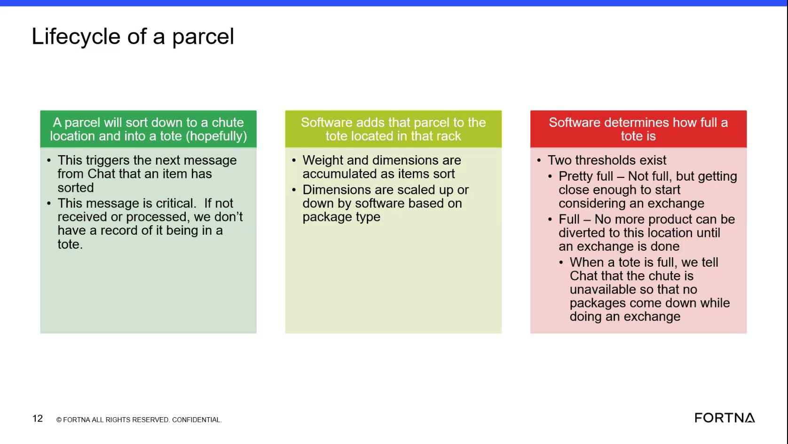

# Verify Sort Confirmation Message And Tote Location Update After Parcel Sort

## Runbook Header

| Field | Value |
| --- | --- |
| Procedure ID | `proc_verify_sort_confirmation_message_and_tote_location_update_after_parcel_sort_v1` |
| Title | Verify Sort Confirmation Message And Tote Location Update After Parcel Sort |
| Procedure Type | `diagnostic` |
| Primary Role | `L1_support` |
| Supporting Roles | None |
| Support Safe | Yes |
| Validation Status | `needs_sme_review` |
| Merge Status | `source_finalized` |

## Summary

Confirm that after a parcel sorts to a chute and into a tote, the critical divert confirm or sort confirmation message is present and the parcel is added to the tote location in the rack.

## When To Use

Use when verifying whether a parcel sort event was properly tracked after the parcel sorted to a chute location and into a tote, specifically to confirm the critical divert confirm or sort confirmation message was received and that the software associated the parcel to the tote location in the rack.

## Safety And Operational Notes

* This is a source-described verification task and is support-safe based on the candidate.
* Do not infer parcel destination or tote contents if the divert confirm or sort confirmation message is missing, because the source states the system may not know where the parcel went or what is in the tote.

## Access Or Tools Needed

* Access to the chat or message view that shows divert confirm or sort confirmation messages
* Access to the software view showing tote location in the rack

## Related Operational Context

* ctx_training_video_parcel_lifecycle_tote_tracking_v1
* ctx_training_video_sort_confirmation_message_v1

## Procedure Steps

### Step 1 — Identify the parcel sort event

**Responsible role:** L1_support

**Instruction:**
Identify the parcel event where the parcel sorted down to a chute location and into a tote.

**Expected result:**
A specific parcel sort event is selected for verification.

**Screens / Images:**

*Look for the lifecycle description stating that a parcel sorts down to a chute location and into a tote.*

**Stop or Escalate If:**

* The parcel event cannot be identified as a chute-to-tote sort event.

---

### Step 2 — Check for the sort confirmation message

**Responsible role:** L1_support

**Instruction:**
Check for the next chat message described in the source as a divert confirm or sort confirmation.

**Expected result:**
A divert confirm or sort confirmation message is visible for the parcel sort event.

**Screens / Images:**

*Look for the slide content describing the next chat message as a divert confirm or sort confirmation.*

**Stop or Escalate If:**

* The divert confirm or sort confirmation message is not present.

---

### Step 3 — Confirm the message was received

**Responsible role:** L1_support

**Instruction:**
Verify that the confirmation message was received, because the source states this message is critical to knowing where the parcel went and what is in the tote.

**Expected result:**
The confirmation message is confirmed as received for the parcel sort event.

**Screens / Images:**

*Look for the statement that the divert confirm or sort confirmation message is critical because without it the system does not know where the parcel went or what is in the tote.*

**Stop or Escalate If:**

* The confirmation message was not received.
* The parcel destination or tote contents cannot be determined because the message is missing.

---

### Step 4 — Verify parcel was added to the tote location

**Responsible role:** L1_support

**Instruction:**
Check that the software added the parcel to the tote location in the rack after the sort confirmation.

**Expected result:**
The parcel appears associated with the tote location in the rack.

**Screens / Images:**

*Look for the lifecycle description stating that software adds the parcel to the tote location in the rack.*

*Look for the container selection view indicators showing tote presence and tote number at a rack location.*

*Look for rack location details and tote lookup concepts that help inspect which tote is on a rack.*

**Stop or Escalate If:**

* The parcel does not appear to be added to the tote location in the rack after the sort event.

---

### Step 5 — Record the verification outcome

**Responsible role:** L1_support

**Instruction:**
Record whether the parcel destination and tote contents can be accounted for from the confirmation message and tote location update.

**Expected result:**
A clear verification outcome is recorded as confirmed or not confirmed.

**Stop or Escalate If:**

* The confirmation message is missing.
* The parcel is not added to the tote location in the rack.
* The parcel destination and tote contents cannot be accounted for from the available evidence.

---

## Success Criteria

* The divert confirm or sort confirmation message is present for the parcel sort event.
* The parcel is shown as added to the tote location in the rack.
* The parcel destination and tote contents can be accounted for from the confirmation message and tote location update.

## Failure Conditions

* The divert confirm or sort confirmation message is not present.
* The confirmation message was not received or cannot be verified.
* The system may not know where the parcel went or what is in the tote.
* The parcel does not appear to be added to the tote location in the rack after the sort event.

## Escalation Guidance

* Escalate if the sort confirmation or divert confirm message is not present, because the source states the system may not know where the parcel went or what is in the tote.
* Escalate if the parcel does not appear to be added to the tote location in the rack after the sort event.

## Missing Details / Known Gaps

* The source does not provide exact screen names for the chat or software views used in this verification.
* The source does not provide a formal logging location or required record format for documenting the verification outcome.
* The source does not provide an estimated completion time.
* The source does not specify a downstream escalation target or team.

## Source Lineage

- Candidate IDs: candidate_training_video_verify_sort_confirmation_and_tote_update
- Source ID: `training_video_day1`
- Source Type: `training_video`
