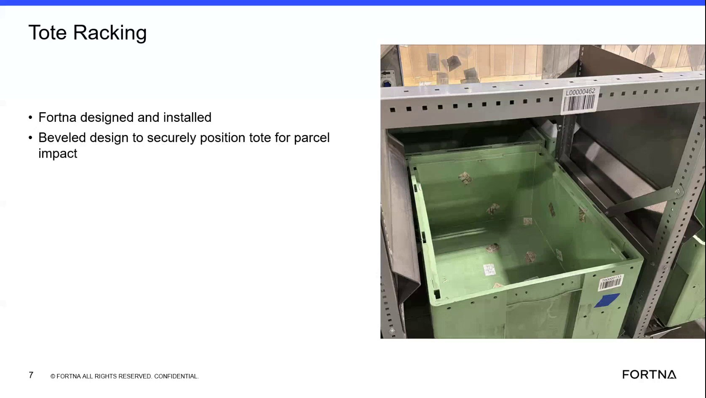

# Verify Tote Rack Centering Features And Tote Positioning

## Runbook Header

| Field | Value |
| --- | --- |
| Procedure ID | `proc_verify_tote_rack_centering_features_and_tote_positioning_v1` |
| Title | Verify Tote Rack Centering Features And Tote Positioning |
| Procedure Type | `reference` |
| Primary Role | `operator` |
| Supporting Roles | None |
| Support Safe | Yes |
| Validation Status | `needs_sme_review` |
| Merge Status | `source_finalized` |

## Summary

Reference check to confirm the tote rack features described in training are present and that the tote position on the cylinder matches the documented centering and secure-positioning design intent.

## When To Use

Use when visually verifying that a tote rack matches the training description for tote placement, centering features, side fins, and beveled positioning design.

## Do Not Use For

* Do not use for repair, adjustment, or corrective maintenance actions.
* Do not use to infer undocumented corrective actions if the rack does not match the training description.

## Safety And Operational Notes

* This source supports a visual reference check only.
* Do not infer repair or adjustment actions because the source describes component features and design intent only.

## Access Or Tools Needed

* Visual access to the tote rack
* Training slide or source description of tote rack features

## Related Operational Context

* ctx_training_video_tote_racking_overview_v1
* ctx_training_video_tote_rack_alignment_features_v1
* ctx_training_video_tote_rack_package_centering_fins_v1
* ctx_training_video_tote_rack_design_intent_v1

## Procedure Steps

### Step 1 — Locate the tote rack and tote position

**Responsible role:** operator

**Instruction:**
Locate the tote rack and identify the position where the tote sits on the cylinder. Compare the observed rack to the training image or description.

**Expected result:**
The tote rack is identified and the tote position on the cylinder is recognizable.

**Screens / Images:**

*Overall tote rack structure and the area identified in training as where the tote sits on the cylinder.*

**Stop or Escalate If:**

* Escalate if the observed tote rack does not match the documented training description.

---

### Step 2 — Verify centering feet are present

**Responsible role:** operator

**Instruction:**
Observe whether the rack includes the small feet described in the source and verify that these features align the dropped tote toward the center position.

**Expected result:**
Small feet are visible on the rack and match the training description of tote-centering features.

**Screens / Images:**

*The little feet or alignment points on the tote rack that the training says align the tote to the center.*

**Stop or Escalate If:**

* Escalate if the observed tote rack does not match the documented training description of feet or positioning features.

---

### Step 3 — Check for tight tote fit

**Responsible role:** operator

**Instruction:**
Check whether the tote fit appears tight in the rack as described in the training segment.

**Expected result:**
The tote fit appears consistent with the training description of a tight fit.

**Screens / Images:**

*How closely the tote position fits within the rack structure shown in the training frame.*

**Stop or Escalate If:**

* Escalate if the observed tote rack does not match the documented training description.

---

### Step 4 — Verify side fins for package centering

**Responsible role:** operator

**Instruction:**
Observe the sides of the tote rack for fins and verify that the fins are positioned to help move packages toward the center if they hit off-center.

**Expected result:**
Side fins are visible and match the training description of package-centering features.

**Screens / Images:**

*The fins on the side of the tote rack referenced in training as helping move packages toward the center.*

**Stop or Escalate If:**

* Escalate if the observed tote rack does not match the documented training description of side fins.

---

### Step 5 — Compare observed rack to beveled design intent

**Responsible role:** operator

**Instruction:**
Compare what is present on the rack to the documented design intent that the tote racking uses a beveled design to securely position the tote for parcel impact.

**Expected result:**
The observed rack features are consistent with the training description of a beveled design intended to securely position the tote.

**Screens / Images:**

*The overall rack geometry and slide text indicating beveled design to securely position the tote for parcel impact.*

**Stop or Escalate If:**

* Escalate if the observed tote rack does not match the documented training description of feet, side fins, or positioning features.
* Stop if corrective or repair action would be required, because this source does not provide those actions.

---

## Success Criteria

* The tote rack can be identified as the structure where the tote sits on the cylinder.
* The small feet described in training are present or visually consistent with the documented centering function.
* The tote fit appears tight as described in the training segment.
* The side fins are present and visually consistent with guiding off-center packages toward the center.
* The observed rack is consistent with the documented beveled design intent to securely position the tote for parcel impact.

## Failure Conditions

* Observed tote rack does not match the documented training description of feet, side fins, or positioning features.
* Tote position on the rack cannot be matched to the training description.
* The source does not provide corrective actions for mismatched or missing features.

## Escalation Guidance

* Escalate if the observed tote rack does not match the documented training description of feet, side fins, or positioning features.
* Escalate if the tote rack cannot be visually confirmed against the training reference.
* Do not infer repair or adjustment actions because the source describes component features and design intent only.

## Missing Details / Known Gaps

* No formal corrective action is provided by the source if features are missing or do not match.
* No time estimate is provided by the source.
* No explicit production-stop or LOTO requirement is stated in the source.
* No role boundary beyond operator-level visual verification is stated in the source.

## Source Lineage

- Candidate IDs: candidate_training_video_verify_tote_rack_centering_features
- Source ID: `training_video_day1`
- Source Type: `training_video`
