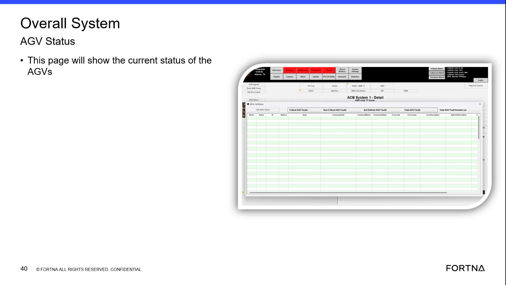

# View Current AUV/AGV Status In The Overall System AGV Status Pop-Up

## Runbook Header

| Field | Value |
| --- | --- |
| Procedure ID | `proc_view_current_auv_agv_status_in_the_overall_system_agv_status_pop_up_v1` |
| Title | View Current AUV/AGV Status In The Overall System AGV Status Pop-Up |
| Procedure Type | `diagnostic` |
| Primary Role | `operator` |
| Supporting Roles | None |
| Support Safe | Yes |
| Validation Status | `needs_sme_review` |
| Merge Status | `source_finalized` |

## Summary

Use the HMI status pop-up or page labeled "Overall System AGV Status" to view detailed current AUV/AGV system status information shown by the source training segment.

## When To Use

Use when an operator or support user needs to inspect the current status details shown in the HMI status display identified in the training as the AUV status pop-up and shown on screen as "Overall System AGV Status."

## Do Not Use For

* Do not use this runbook to interpret the meaning of status values or indicators that are not explained in the source.
* Do not use this runbook as navigation guidance for exact clicks or menu paths, because the source does not provide explicit navigation steps.
* Do not use this runbook for corrective actions or recovery actions; the source only supports viewing current status information.

## Safety And Operational Notes

* This source supports a view/inspection activity only.
* Do not infer meanings for displayed status values or indicators unless the source explicitly explains them.
* A terminology mismatch exists in the source: the transcript says "AUV status" while the on-screen title reads "Overall System AGV Status." Preserve both terms when communicating findings from this source.

## Access Or Tools Needed

* Access to the OptiSweep HMI or training screen showing the AUV/AGV status pop-up
* Overall System AGV Status pop-up or page

## Related Operational Context

* ctx_training_video_auv_status_popup_v1
* ctx_training_video_overall_system_agv_status_v1
* ctx_training_video_auv_agv_status_terminology_v1

## Procedure Steps

### Step 1 — Open or view the Overall System AGV Status pop-up

**Responsible role:** operator

**Instruction:**
Open or navigate to the AUV status pop-up referenced in the training segment, identified on screen as "Overall System AGV Status." Use the available HMI or displayed training screen to bring this status view into view.

**Expected result:**
The status pop-up or page is visible to the user.

**Screens / Images:**

*The page or pop-up title area showing "Overall System AGV Status."*

**Stop or Escalate If:**

* The AUV/AGV status pop-up cannot be accessed.
* The expected status display cannot be brought into view.

---

### Step 2 — Confirm the correct status view is displayed

**Responsible role:** operator

**Instruction:**
Confirm that the displayed page is the status view by checking for the title text "Overall System AGV Status."

**Expected result:**
The page title matches the source-supported status view.

**Screens / Images:**

*The title text reading "Overall System AGV Status."*

**Stop or Escalate If:**

* The expected "Overall System AGV Status" page title is not present.

---

### Step 3 — Review the detailed current status information

**Responsible role:** operator

**Instruction:**
Review the detailed status information shown on the pop-up or page, using the source-described purpose that it "shows you in details" and "will show the current status."

**Expected result:**
The user can see the current status information presented by the status display.

**Screens / Images:**

*The status information area associated with the text indicating the page shows the current status.*

**Stop or Escalate If:**

* The page does not show the expected current status information.

---

### Step 4 — Observe the displayed status indicators or fields

**Responsible role:** operator

**Instruction:**
Observe any status indicators, condition fields, or system-level status details shown on the screen, but use only the values and meanings explicitly provided by the source.

**Expected result:**
The displayed status indicators or fields are observed as presented on the screen.

**Screens / Images:**

*The screen region showing the status details or fields presented in the pop-up.*

**Stop or Escalate If:**

* You would need to infer meanings for displayed values or indicators that are not explained in the source.

---

### Step 5 — Record or communicate the current status shown

**Responsible role:** operator

**Instruction:**
Record or communicate the current status information displayed if needed for operations or troubleshooting.

**Expected result:**
The currently displayed status information is available to others if needed.

**Stop or Escalate If:**

* The status view was not confirmed as the correct page.
* The displayed information cannot be accessed or read clearly.

---

## Success Criteria

* The user is able to view the Overall System AGV Status pop-up/page.
* The title "Overall System AGV Status" is visible and confirms the correct screen.
* Current detailed status information can be inspected from the displayed page.

## Failure Conditions

* The AUV/AGV status pop-up cannot be accessed.
* The expected "Overall System AGV Status" title is not present.
* Displayed values or indicators would require unsupported interpretation beyond what the source explains.

## Escalation Guidance

* Escalate if the AUV/AGV status pop-up cannot be accessed.
* Escalate if the expected "Overall System AGV Status" page title is not present.
* Stop and seek clarification if interpretation of displayed status values or indicators is required but not explained in the source.

## Missing Details / Known Gaps

* The source does not provide explicit navigation clicks, menu paths, or button names for opening the status pop-up/page.
* The source does not define specific field names, status values, or indicator meanings beyond the page title and statement that it shows current status.
* The source does not specify time estimate, supporting roles, or escalation contact path.
* The source uses both "AUV" in speech and "AGV" in on-screen text without resolving the terminology difference.

## Source Lineage

- Candidate IDs: candidate_training_video_view_auv_agv_status_popup
- Source ID: `training_video_day1`
- Source Type: `training_video`
