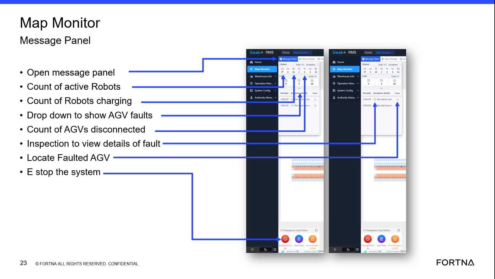

# View Pending Messages And Recent Alarm History In The Message Panel

## Runbook Header

| Field | Value |
| --- | --- |
| Procedure ID | `proc_view_pending_messages_and_recent_alarm_history_in_the_message_panel_v1` |
| Title | View Pending Messages And Recent Alarm History In The Message Panel |
| Procedure Type | `diagnostic` |
| Primary Role | `operator` |
| Supporting Roles | None |
| Support Safe | Yes |
| Validation Status | `needs_sme_review` |
| Merge Status | `source_finalized` |

## Summary

Use the map monitor summary area message panel to view pending messages containing active errors or warnings and review recent alarm history described as approximately the past 24 to 48 hours.

## When To Use

Use when an operator needs to check the map monitor summary area for current pending messages, active errors or warnings, or recent alarm history visible in the message panel.

## Do Not Use For

* Do not use this procedure to interpret alarm meanings beyond what is shown in the panel.
* Do not use this procedure as a corrective action or recovery procedure because the source only supports viewing and reviewing the panel contents.

## Safety And Operational Notes

* This source supports viewing information in the HMI message panel only.
* Do not infer corrective actions, alarm meanings, or recovery steps beyond what is explicitly shown in the source.

## Access Or Tools Needed

* Access to the map monitor summary area
* Message panel on the HMI

## Related Operational Context

* ctx_training_video_message_panel_alarm_history_v1

## Procedure Steps

### Step 1 — Locate the message panel in the map monitor summary area

**Responsible role:** operator

**Instruction:**
Go to the map monitor summary area and locate the open message panel shown in the training material.

**Expected result:**
The message panel location in the map monitor summary area is identified.

**Screens / Images:**

*The map monitor summary area showing the open message panel location and its purpose.*

*The right-side Map Monitor message panel and related status area.*

**Stop or Escalate If:**

* Escalate if the message panel cannot be located and the source provides no further navigation detail.

---

### Step 2 — View pending active messages

**Responsible role:** operator

**Instruction:**
Open the message panel if needed and view the pending messages shown there for active errors or warnings.

**Expected result:**
Pending messages containing active errors or warnings are visible in the panel.

**Screens / Images:**

*The message panel area described as showing pending messages containing active errors or warnings.*

**Stop or Escalate If:**

* Escalate if the panel does not show expected messages and the source does not provide further recovery steps.

---

### Step 3 — Review recent alarm history

**Responsible role:** operator

**Instruction:**
Review the alarm history shown in the message panel for alarms generated over approximately the past 24 to 48 hours.

**Expected result:**
Recent alarm history entries are visible for review in the panel.

**Screens / Images:**

*The message panel description indicating alarm history for roughly the past 24 to 48 hours.*

**Stop or Escalate If:**

* Escalate if expected alarm history is not shown and the source does not provide additional troubleshooting.

---

### Step 4 — Record visible messages and alarm entries

**Responsible role:** operator

**Instruction:**
Record the active errors, warnings, or recent alarm entries that are visible in the message panel.

**Expected result:**
The visible active errors, warnings, or recent alarm entries are documented by the operator.

**Screens / Images:**

*The message panel contents that show pending messages and recent alarm history to be recorded.*

**Stop or Escalate If:**

* Escalate if the panel does not show expected messages or history and the source does not provide further recovery steps.
* Stop short of assigning alarm meaning or corrective action beyond what is shown in the source.

---

## Success Criteria

* The operator can locate the message panel in the map monitor summary area.
* Pending messages containing active errors or warnings are visible in the panel.
* Recent alarm history for approximately the past 24 to 48 hours can be reviewed.
* Visible active messages or alarm entries are recorded for follow-up.

## Failure Conditions

* The message panel cannot be located.
* Expected pending messages are not shown.
* Expected recent alarm history is not shown.
* The source does not provide further recovery or interpretation steps.

## Escalation Guidance

* Escalate if the panel does not show expected messages or history and the source does not provide further recovery steps.
* Escalate when the operator cannot locate or access the message panel from the map monitor summary area.
* Do not infer alarm meanings or corrective actions beyond what is shown in the source.

## Missing Details / Known Gaps

* The source does not provide exact click sequence or control name for opening the message panel.
* The source does not provide corrective actions for any errors, warnings, or alarms shown.
* The source does not define how to export, save, or formally log the visible entries.
* The source describes the alarm history window approximately as the past 24 to 48 hours rather than a fixed retention value.

## Source Lineage

- Candidate IDs: candidate_training_video_view_message_panel_and_alarm_history
- Source ID: `training_video_day1`
- Source Type: `training_video`
