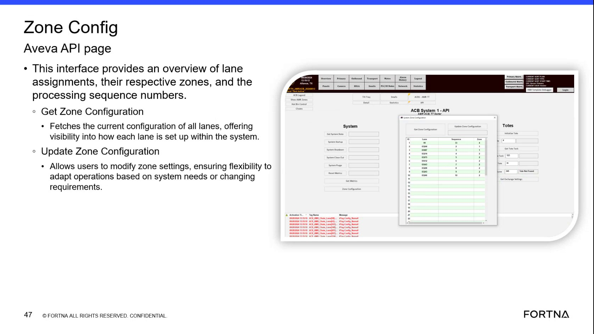

# View Current Lane Zone Configuration on the Zone Config Aveva API Page

## Runbook Header

| Field | Value |
| --- | --- |
| Procedure ID | `proc_view_current_lane_zone_configuration_on_the_zone_config_aveva_api_page_v1` |
| Title | View Current Lane Zone Configuration on the Zone Config Aveva API Page |
| Procedure Type | `diagnostic` |
| Primary Role | `L1_support` |
| Supporting Roles | None |
| Support Safe | Yes |
| Validation Status | `needs_sme_review` |
| Merge Status | `source_finalized` |

## Summary

Use the Zone Config Aveva API page and its Get Zone Configuration function to view the current configuration of all lanes, including lane assignments, respective zones, and processing sequence numbers.

## When To Use

Use when you need visibility into the current lane configuration in the system and need to review lane assignments, zones, and processing sequence numbers using the Zone Config Aveva API page.

## Do Not Use For

* Do not use this runbook to update or modify zone settings; the source mentions Update Zone Configuration exists, but this procedure only covers viewing current configuration.
* Do not use this runbook to infer a navigation path to the page; the source does not provide the menu path or exact navigation sequence.

## Safety And Operational Notes

* This source describes a view/inspection activity and does not describe physical intervention.
* Do not perform configuration changes as part of this procedure; this runbook is limited to viewing current configuration.

## Access Or Tools Needed

* Access to the Zone Config Aveva API page
* Get Zone Configuration function

## Related Operational Context

* ctx_training_video_zone_config_aveva_api_page_v1
* ctx_training_video_get_zone_configuration_v1

## Procedure Steps

### Step 1 — Open the Zone Config Aveva API page

**Responsible role:** L1_support

**Instruction:**
Open or navigate to the Zone Config Aveva API page.

**Expected result:**
The Zone Config Aveva API page is displayed.

**Screens / Images:**

*Zone Config Aveva API page title and overall page layout.*

**Stop or Escalate If:**

* Escalate if the page does not display the expected lane configuration information.

---

### Step 2 — Locate lane assignment and zone details on the page

**Responsible role:** L1_support

**Instruction:**
Locate the lane assignment, zone, and processing sequence number information shown on the page.

**Expected result:**
The displayed page content identifies lane assignments, respective zones, and processing sequence numbers.

**Screens / Images:**

*The page content describing lane assignments, respective zones, and processing sequence numbers.*

**Stop or Escalate If:**

* Escalate if the page does not display the expected lane configuration information.

---

### Step 3 — Run Get Zone Configuration

**Responsible role:** L1_support

**Instruction:**
Use the Get Zone Configuration function to fetch the current configuration of all lanes.

**Expected result:**
The system returns the current configuration of all lanes.

**Screens / Images:**

*The Get Zone Configuration function on the Zone Config Aveva API page.*

**Stop or Escalate If:**

* Escalate if the Get Zone Configuration function does not return the current configuration of all lanes.

---

### Step 4 — Review the returned lane setup information

**Responsible role:** L1_support

**Instruction:**
Review the returned lane setup information to verify how each lane is configured within the system.

**Expected result:**
The returned information provides visibility into how each lane is set up.

**Screens / Images:**

*Returned lane setup information associated with Get Zone Configuration.*

**Stop or Escalate If:**

* Escalate if the Get Zone Configuration function does not return the current configuration of all lanes.

---

### Step 5 — Compare displayed configuration details

**Responsible role:** L1_support

**Instruction:**
Compare the displayed lane assignments, respective zones, and processing sequence numbers against the information you need to confirm or record.

**Expected result:**
The needed lane configuration details are confirmed or recorded from the displayed information.

**Screens / Images:**

*Lane assignments, respective zones, and processing sequence numbers shown on the Zone Config Aveva API page.*

**Stop or Escalate If:**

* Escalate if the page does not display the expected lane configuration information.
* Escalate if the Get Zone Configuration function does not return the current configuration of all lanes.

---

## Success Criteria

* The Zone Config Aveva API page is visible.
* Lane assignments, respective zones, and processing sequence numbers can be viewed.
* Get Zone Configuration returns the current configuration of all lanes.
* The user can confirm or record the displayed lane setup information.

## Failure Conditions

* The page does not display the expected lane configuration information.
* Get Zone Configuration does not return the current configuration of all lanes.
* The returned information is insufficient to verify lane setup.

## Escalation Guidance

* Escalate if the page does not display the expected lane configuration information.
* Escalate if the Get Zone Configuration function does not return the current configuration of all lanes.

## Missing Details / Known Gaps

* The source does not provide the exact navigation path to reach the Zone Config Aveva API page.
* The source does not provide field-by-field output examples for the returned lane configuration.
* The source does not provide explicit role boundaries beyond support-oriented context.
* The source does not provide an estimated completion time.
* The source does not define specific escalation targets or contacts.

## Source Lineage

- Candidate IDs: candidate_training_video_view_zone_configuration
- Source ID: `training_video_day1`
- Source Type: `training_video`
